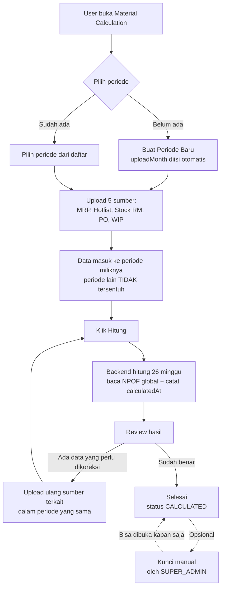

# Rancangan: Material Calculation — MRP 26 Minggu + Periode Bulanan Terisolasi

> Status: **DRAF UNTUK REVIEW**
> Ruang lingkup: menu Material Planning → Material Calculation
>
> | Revisi | Tanggal | Perubahan |
> |---|---|---|
> | 1 | 23 Sep 2026 | Draf awal |
> | 2 | 24 Sep 2026 | **Koreksi semantik:** "snapshot permanen" → **periode terisolasi**. Data dalam satu bulan masih bisa diedit; hanya antar bulan yang tidak saling mempengaruhi. `LOCKED` permanen dihapus. Ditambahkan `CycleSourceUpload` (jejak upload), flag stale, dan timestamp perhitungan. |
> | 3 | 24 Sep 2026 | **Dua koreksi:** (a) identitas periode berbasis **tanggal upload + pemakaian data**, bukan tanggal di dalam data — `dataMonth` diganti `uploadMonth`; (b) **NPOF adalah pengecualian** — dipakai bersama semua periode, `CycleNpofRef` **dibatalkan**. |
> | 4 | 24 Sep 2026 | **11 keputusan user dimasukkan** (lihat §1.2): re-upload = override + konfirmasi, `npofVersionAt` dihapus, konfirmasi NPOF berubah, 1 rim = 500 sheets, part tanpa NPOF pakai jumbo roll + label, hak edit ADMIN/SUPER_ADMIN, audit log perubahan, hasil lama opsional disimpan, format nama periode. |
> | 5 | 24 Sep 2026 | **7 keputusan lanjutan:** stock **jumlahkan semua lot** (+ detail per lot di Master Data), nama periode unik & bisa diedit, lead-time demand dari **minggu ke-1**, retensi **18 bulan**, **1 periode = 1 MRP**. **Temuan besar:** fuzzy match ternyata gagal karena perbedaan *semantik dimensi* — lihat §2.6. |
> | 6 | 24 Sep 2026 | **3 keputusan final:** (a) pencocokan stok = **gramatur sama + ukuran terdekat yang ≥ kebutuhan** (tidak boleh lebih kecil) — lihat §2.6; (b) part riil & estimasi **boleh digabung** + keterangan; (c) hasil ber-`isSaved` **tidak dihapus otomatis** — user diberi tahu dulu, lihat §4.4. |
> | 7 | 24 Sep 2026 | **Toleransi ukuran = maksimal 2 cm** + kandidat **dijumlahkan semua** (§2.6). **Temuan besar:** satu stok dipakai banyak part → **double-count 278.850 kg** (§2.7) — perlu keputusan. Retensi: kalau user tidak merespons, **modal muncul saat buka halaman** Material Calculation (§4.4). |
> | 8 | 24 Sep 2026 | **Alokasi stok = berurutan berdasarkan waktu kebutuhan** (bukan proporsional / bukan dibagi rata) — lihat §2.7. **Ukuran sama persis diprioritaskan** di atas toleransi, tanpa melihat waktu (§2.6). Toleransi dibuat **configurable**. Retensi: "simpan lagi" selalu disertai **pilihan durasi**, lalu notifikasi muncul lagi saat jatuh tempo (§4.4). |
> | 9 | 24 Sep 2026 | **Toleransi final = 2 cm** (tetap configurable) — §2.6. **Tie-breaker minggu yang sama** diformalkan: utamakan part yang kebutuhannya bisa ditutup penuh, lalu kecocokan ukuran terbaik — §2.7. **Durasi retensi = 3 / 6 / 9 / 12 bulan** — §4.4. Penjelasan double-count ditambahkan di §2.7. |
> | 10 | 24 Sep 2026 | **Tie-breaker minggu yang sama diperjelas** dengan 3 situasi + 1 kasus tabrakan (§2.7). **Tie-breaker terakhir = part number A→Z.** Penjelasan double-count dilengkapi ilustrasi (§2.7). |
> | 11 | 24 Sep 2026 | **Kasus tabrakan diputuskan = PILIHAN X**: kecocokan ukuran menentukan dulu (sama persis → selisih terkecil), baru "bisa ditutup penuh" sebagai tie-breaker kedua — §2.7. **Tidak ada lagi pertanyaan terbuka soal alokasi.** |

---

## 1. Ringkasan Eksekutif

### Perubahan yang diminta
| # | Sebelum | Sesudah |
|---|---|---|
| 1 | Hitung untuk **1 bulan** yang dipilih user | Hitung untuk **26 minggu penuh** sesuai MRP yang diupload |
| 2 | Data master **ditimpa** setiap upload | Setiap bulan jadi **periode terisolasi** — antar bulan tidak saling mempengaruhi |
| 3 | History tersimpan **hanya jika** user klik "Simpan History" | History **otomatis** jadi sumber data, bukan salinan |
| 4 | MRP/WIP dipakai bersama Production Planning | MRP/WIP **dipisah** untuk Material Planning |
| 5 | Tidak ada jejak kapan data diupload/dihitung | Tercatat **kapan diupload** dan **kapan dihitung** |

### ⚠️ Klarifikasi penting: semantik isolasi

Istilah *snapshot permanen* di draf awal **terlalu kuat** dan perlu dikoreksi. Semantik yang benar:

| Aspek | Aturan |
|---|---|
| **Antar bulan** (lintas periode) | 🔒 **Terisolasi mutlak.** Upload/edit di bulan Juli **tidak boleh** mengubah sedikit pun data atau angka di bulan Juni, dan sebaliknya |
| **Dasar isolasi** | 📅 Ditentukan oleh **tanggal upload** + **data apa yang dipakai** — **bukan** tanggal yang tertulis di dalam data (lihat §3.3) |
| **Dalam bulan yang sama** | ✏️ **Masih bisa diedit.** Data bulan Juni boleh diperbaiki/di-upload ulang kapan saja — asalkan tidak menyentuh bulan lain |
| **Hasil perhitungan** | 🔄 Dihitung ulang setelah ada perubahan data di bulan yang sama |
| **Jejak waktu** | 📅 Setiap periode mencatat **kapan data diupload** dan **kapan perhitungan dijalankan** |
| **NPOF** | ⚠️ **PENGECUALIAN** — NPOF **dipakai bersama oleh semua periode**, tidak terisolasi (lihat §3.2) |

Jadi mekanisme intinya adalah **partisi data yang ketat per batch upload** — bukan penguncian permanen, dan **bukan** pemisahan berdasarkan tanggal yang tertulis di dalam data. Tidak ada status "LOCKED permanen" di rancangan final — penguncian manual tetap disediakan sebagai opsi keamanan saja (lihat §4.1).

### 1.2 Keputusan yang Sudah Ditetapkan

| # | Topik | Keputusan |
|---|---|---|
| 1 | Dua upload di bulan yang sama | **Tetap satu periode.** Upload baru **menimpa** data lama, dengan dialog konfirmasi lebih dulu |
| 2 | Penamaan periode | Nama **otomatis dari bulan upload**, **bisa diedit**, dan **tidak boleh duplikat** (`label` unique) |
| 3 | Indikator versi NPOF (`npofVersionAt`) | **Tidak dipakai** — field dihapus dari rancangan |
| 4 | Konfirmasi saat NPOF berubah | **Ada.** Sebelum hitung ulang, minta konfirmasi bahwa perhitungan akan mengikuti NPOF terbaru |
| 5 | Konversi rim | **1 rim = 500 sheets.** Tampilkan juga dalam satuan rim + keterangan **"(1 rim = 500 sheets)"** |
| 6 | Stock multi-lot | ✅ **Jumlahkan semua lot per item desc.** Master Data tampilkan total + detail per lot di dropdown. Material calc pakai total. Lihat §2.4 & §8.6 |
| 7 | Part tanpa data NPOF | Tetap dihitung memakai **jumbo roll 180 cm** + label **"Belum ada data NPOF"** |
| 8 | Hak edit data periode | **ADMIN** dan **SUPER_ADMIN** saja |
| 9 | Jejak perubahan | Catat **siapa mengubah apa** + timestamp → tabel `CycleAuditLog` |
| 10 | Hasil perhitungan lama | **Pilihan user** — bisa disimpan sebagai versi, atau tidak disimpan |
| 11 | Kunci manual (`isLocked`) | Tetap **opsional**, default OFF (dari Revisi 2) |
| 12 | Lead-time demand | Dihitung dari **minggu ke-1 MRP** — lihat §6.3 |
| 13 | Retensi data periode | **18 bulan (1,5 tahun)** — lihat §4.4 |
| 14 | Jumlah MRP per periode | **Tepat 1 MRP** (26 minggu) |
| 15 | Tampilan hasil | Kalkulasi minggu 1–26 muncul sesuai formula yang sudah ada — lihat §8.3 |
| 16 | Pencocokan stok & PO | **Gramatur sama** + **ukuran sama persis diprioritaskan** (tanpa melihat waktu). Kalau tidak ada, ukuran **≥ kebutuhan** dengan **selisih maksimal 2 cm** (configurable) — lihat §2.6 |
| 17 | Beberapa kandidat ukuran lolos | **Jumlahkan semuanya**, bukan ambil satu terdekat — lihat §2.6 |
| 18 | Part riil + estimasi dalam satu grup | **Boleh digabung** + wajib diberi keterangan estimasi — lihat §8.5 |
| 19 | Hasil ber-`isSaved` saat retensi | **Tidak dihapus otomatis.** Modal muncul saat buka halaman; "tetap simpan" disertai pilihan durasi **3 / 6 / 9 / 12 bulan**; saat jatuh tempo modal muncul lagi — lihat §4.4 |
| 20 | Toleransi ukuran | **2 cm (final)**, tapi dibuat **configurable** karena bisa berubah — lihat §2.6 |
| 21 | Kebutuhan di minggu yang sama | Urut: (1) **kecocokan ukuran terbaik** (sama persis → selisih terkecil) → (2) yang **bisa ditutup penuh** → (3) **part number A→Z**. Ukuran lebih menentukan daripada full-cover — lihat §2.7 |
| 20 | Stok dipakai banyak part | **Alokasi berurutan berdasarkan waktu kebutuhan** — habiskan untuk 1 part dulu, sisanya ke part berikutnya. **Dilarang dibagi rata** — lihat §2.7 & §6.8 |
| 21 | Toleransi ukuran | **2 cm saat ini**, tapi dibuat **configurable** karena kemungkinan berubah — lihat §2.6 |
| 16 | Pencocokan stok & PO | **Gramatur sama + ukuran terdekat yang ≥ kebutuhan** (tidak boleh lebih kecil). Hasil kalkulasi tetap pakai ukuran kebutuhan sebenarnya — lihat §2.6 |
| 17 | Part riil + estimasi dalam satu grup | **Boleh digabung**, tapi wajib diberi keterangan bahwa informasinya belum lengkap/estimasi — lihat §8.5 |
| 18 | Hasil ber-`isSaved` saat retensi | **Tidak dihapus otomatis.** User diberi tahu lebih dulu; kalau belum di-*accept*, data tetap ada — lihat §4.4 |

### Jawaban atas pertanyaan "apakah struktur DB berubah?"
**Ya — signifikan.** Dibutuhkan **9 tabel baru + 1 enum**, karena ada 3 unique constraint yang secara teknis memblokir penyimpanan multi-bulan:

| Tabel | Constraint sekarang | Akibat |
|---|---|---|
| `hotlists` | `partNumber @unique` | Tidak mungkin simpan Hotlist Juni **dan** Juli |
| `wips` | `@@unique([itemId, location])` | WIP Juni tertimpa WIP Juli |
| `weekly_schedule` | `@@unique([year, weekNumber, itemId])` | MRP bulan baru menimpa MRP bulan lama |

Ditambah: upload Hotlist mode *overwrite* menjalankan `prisma.hotlist.deleteMany({})` **tanpa filter** — menghapus seluruh tabel, bukan per bulan.

---

## 2. Kondisi Data Saat Ini (hasil inspeksi)

### 2.1 Statistik tabel

| Tabel | Baris | Catatan |
|---|---|---|
| `items` | 2.952 | master part number |
| `npof_materials` | 357 | hanya **306** part number unik |
| `weekly_schedule` (MRP) | **16.107** | 26 minggu × 2.145 part |
| `hotlists` | 689 | 1 tanggal saja (2026-09-15) |
| `wips` | **16.304** | 1.019 item × 16 lokasi, 1 tanggal |
| `stock_raw_materials` | 469 | hanya 56 grup item+supplier |
| `outstanding_pos` | 25 | semua supplier MEGA |
| `calculation_histories` | 1 | monthKey `2026-12`, 4 minggu |

### 2.2 ✅ MRP sudah 26 minggu penuh

```
weekNumber    : 1 → 26
weekStartDate : 2026-09-19 → 2027-03-19
tahun         : 2026 (semua baris)
```

Setiap minggu punya demand, jumlah part per minggu 109–861:

| Minggu | Mulai | Part | Total Qty |
|---|---|---|---|
| 1 | 2026-09-19 | 684 | 3.409.565 |
| 7 | 2026-10-31 | 861 | 4.517.722 |
| 14 | 2026-12-19 | 770 | 4.851.638 |
| 20 | 2027-01-30 | 435 | 1.969.191 |
| 26 | 2027-03-13 | 198 | 1.306.396 |

**Kesimpulan:** data MRP 26 minggu **sudah tersedia**. Yang membatasi hanya UI (`mrpMonths` → dropdown pilih bulan) dan backend (`where: { weekStartDate: { gte: periodStart, lt: periodEnd } }`).

### 2.3 ✅ Temuan kritis #1 — 97,7% part tidak punya data NPOF (**sudah ada keputusan**)

```
Part number di MRP        : 2.145
Part number di NPOF       :   306
Cocok (match)             :    49
Tidak punya data NPOF     : 2.096  ← 97,7%
```

Dan data NPOF sendiri tidak lengkap:

| Field | Kosong | Persentase |
|---|---|---|
| `gramatur` | 229 / 357 | **64%** |
| `formulaMaterial` | 221 / 357 | **62%** |
| `sheetedSize` | 99 / 357 | 28% |
| `ups` | 66 / 357 | 18% |
| `supplier` | 14 / 357 | 4% |

**Dampak:** 2.096 part dihitung memakai *fallback* per family (jumbo roll 180 cm, gramatur median, formula material median, UPS median). Artinya mayoritas angka yang keluar saat ini berbasis **estimasi**, bukan data riil per part.

Ini konsisten dengan tampilan sekarang yang hanya menghasilkan 11 grup — 2.096 part itu menyatu ke beberapa grup *fallback*.

#### ✅ Keputusan user

| Aspek | Keputusan |
|---|---|
| Tetap dihitung? | **Ya** — jangan di-*exclude*, tetap masuk perhitungan |
| Ukuran default | **Jumbo roll 180 cm** |
| Penanda | Beri keterangan **"Belum ada data NPOF"** pada part tersebut |

Jadi part tanpa NPOF **dibeli dulu dalam ukuran jumbo roll**, dengan penanda jelas di UI supaya user tahu angkanya masih estimasi dan bisa dikoreksi setelah NPOF dilengkapi.

> **Catatan implementasi:** perilaku *fallback* ke jumbo roll sudah ada di kode sekarang (`normalizeNpofText(npof?.sheetedSize, '180cm (jumbo roll)')`). Yang perlu ditambahkan adalah **membuat penandanya terlihat jelas di UI** — sekarang flag `noNpofData` sudah dikirim backend, tapi tampilannya belum menonjol.

> **Perlu perhatian:** dengan 97,7% part memakai fallback, ada risiko angka estimasi **tercampur** dengan angka riil dalam satu total grup. Perlu keputusan tambahan apakah keduanya boleh digabung dalam satu total, atau dipisah (lihat §12).

### 2.4 ✅ Temuan kritis #2 — Stock Raw Material: hanya 1 lot yang dihitung (**sudah ada keputusan**)

#### Apa yang terjadi

Tabel `stock_raw_materials` menyimpan **satu baris per LOT**, bukan satu baris per material. Contoh nyata dari data Anda:

```
itemDesc = "DUPLEX 350GSM/ 82CM"   supplier = "XSD"   date = 2026-08-06

  Lot 1  →  886 kg
  Lot 2  →  892 kg
  Lot 3  →  886 kg
  ...
  Lot 17 →  875 kg       (17 baris, semuanya di tanggal yang sama)

  Jumlah seluruh lot = 14.870 kg
```

Kalau 17 baris itu memang 17 lot fisik berbeda, maka **stok nyata material ini = 14.870 kg**.

Tapi kode di `materialCalc.ts` hanya mengambil **baris pertama** saja:

```ts
const latestStockMap = new Map<string, typeof stocks[0]>();
for (const s of stocks) {
  const key = `${s.itemDesc}||${s.supplier || ''}`;
  if (!latestStockMap.has(key)) latestStockMap.set(key, s);   // ← hanya baris pertama
}
```

Hasilnya yang terbaca hanya **875 kg** — bukan 14.870 kg.

#### Bukti dari data

| Item Desc | Supplier | Jumlah lot | Terhitung sekarang | Jika semua lot dijumlah | Selisih |
|---|---|---|---|---|---|
| DUPLEX 400GSM/ 70.5CM | XSD | 53 | 741 | **38.530** | 52× |
| DUPLEX 350GSM/ 80X144.5CM | XSD | 41 | 2.300 | **94.300** | 41× |
| DUPLEX 400GSM/ 71X115CM | XSD | 36 | 2.000 | **70.000** | 35× |
| DUPLEX 400GSM/ 70.5X117CM | XSD | 16 | 1.800 | **27.800** | 15× |

Dari 56 grup material, **42 grup punya lebih dari 1 lot**.

**Dampak:** "Stock As Of" jadi jauh lebih kecil dari kenyataan → **shortage jauh lebih besar dari seharusnya** → berisiko menyebabkan pembelian material berlebih.

#### ✅ Keputusan user

**Jumlahkan semua lot per item desc.** Jadi jawabannya **A** — 53 baris = 53 lot fisik berbeda, total 38.530 kg.

| Konteks | Perlakuan |
|---|---|
| **Master Data (Stock Raw Material)** | Tampilkan **total gabungan** sebagai angka utama, dengan **detail per lot di dropdown** (§8.6) |
| **Material Calculation** | Ambil **total seluruh lot per item desc** — bukan satu lot |

> ⚠️ **Efek besar yang harus disadari:** setelah perubahan ini, "Stock As Of" naik drastis dan **shortage turun drastis**. Angka sebelum vs sesudah akan jauh berbeda — perlu **perbandingan sebelum-sesudah** dan review bersama tim bisnis sebelum dipakai untuk keputusan pembelian.

> ⚠️ **Catatan tanggal stok:** dari 56 grup, **5 grup punya lebih dari satu tanggal stok** (mis. `DUPLEX 400GSM/ 71X115CM` XSD: 2026-05-11 dan 2026-05-19). Keputusan "jumlahkan semua lot" diterapkan pada **seluruh lot tanpa memandang tanggal**. Kalau ke depan file stok berisi beberapa snapshot bulanan, perlu aturan tambahan agar tidak terhitung ganda. Saat ini risikonya kecil karena hanya 5 grup.

### 2.5 ✅ Temuan kritis #3 — `rim` dihitung sebagai 1 sheet (**sudah dikonfirmasi**)

Outstanding PO punya 25 baris: 13 unit `kg`, 12 unit `rim`.

Di `materialCalc.ts`:
```ts
} else if (unit === 'sheet' || unit === 'sheets' || unit === 'rim') {
  existing.sheet += remaining;   // ← 1 rim dihitung = 1 sheet
}
```

**Keputusan user: 1 rim = 500 sheets.** Jadi selama ini PO berbentuk rim **under-count hingga 500×**.

**Contoh nyata dari data:** PO `DUPLEX 270GSM/ 99X126.5CM` dari MEGA — `qtyOrder` 61,6 rim.
- Terhitung sekarang: **61,6 sheet**
- Seharusnya: **30.800 sheet**

**Tambahan yang diminta:** tampilkan kuantitas dalam **satuan rim juga**, dengan keterangan **"(1 rim = 500 sheets)"** supaya user tidak perlu menghitung sendiri. Lihat §8.4 untuk rancangan tampilannya.

### 2.6 🔴 Temuan kritis #4 — Fuzzy match stok: **dua sisi memakai semantik dimensi berbeda**

> Temuan ini sudah diuji langsung ke database (`inspect-data3.ts`). Kesimpulannya **berbeda dari dugaan awal** — masalahnya bukan sekadar salah cocok teks.

#### Hasil pengujian

| Metrik | Angka |
|---|---|
| NPOF dengan `gramatur` + `sheetedSize` lengkap | 128 |
| Yang **berhasil** menemukan item stok | **20 (15,6%)** |
| Yang **tidak** menemukan | 108 (84,4%) |

Jadi memang hanya ±16% yang cocok — tapi penyebabnya perlu dilihat lebih dalam.

#### Penyebab #1 — stok disimpan dalam dimensi ROLL, NPOF dalam dimensi POTONG

Ini akar masalahnya:

```
NPOF  : gramatur 450, sheetedSize "63.5 × 89 CM"   ← ukuran hasil POTONG
STOK  : "DUPLEX 450GSM/ 88X95CM"                   ← ukuran ROLL induk
        "DUPLEX 450GSM/ 102CM"
        "DUPLEX 450GSM/ 120CM"
```

Ukuran potong (63,5 × 89) **tidak akan pernah** sama dengan ukuran roll (88×95, 102, 120). Bukan karena kode salah, tapi karena kedua sisi menyimpan hal yang berbeda.

Cara kerja `fuzzyMatch` sekarang menuntut **semua token** ada di item desc:

```ts
const tokens = npofDescriptor.split(/[\s,x×\/]+/).filter(t => t.length >= 2);
return tokens.every(token => desc.includes(token));
```

Descriptor `"450 63.5 × 89 cm"` → token `['450','63.5','89','cm']`. Stok `"duplex 450gsm/ 88x95cm"` hanya punya `450`, `88`, `95`, `cm` → **63.5 dan 89 tidak ada** → gagal.

#### Penyebab #2 — 20 kecocokan yang "berhasil" justru **kebetulan**

Semua kecocokan yang ditemukan punya pola yang sama:

```
NPOF PP2BOX25WMT02 : gramatur="400", sheetedSize="-"   → descriptor "400 -"
NPOF JTP93-0941    : gramatur="450", sheetedSize="-"   → descriptor "450 -"
```

Karena `sheetedSize`-nya kosong (`"-"`), descriptor-nya hanya berisi **satu token angka**: `"400"`. Lalu token itu cocok ke item desc apa pun yang mengandung "400" — termasuk `DUPLEX 400GSM/ 71X115CM`, `DUPLEX 400GSM/ 70.5CM`, `DUPLEX 400GSM/ 98X121CM`.

Karena kode menjumlahkan **semua** item yang cocok, satu part dengan kebutuhan 400gsm 70,5cm bisa **mendapat stok gabungan semua material 400gsm** dari supplier itu → **over-count**.

#### Ringkasnya

| Kondisi | Perilaku sekarang | Benar? |
|---|---|---|
| `sheetedSize` kosong (`"-"`) | Cocok ke semua desc yang punya angka gramatur sama | ❌ **Over-count** |
| `sheetedSize` terisi (mis. `"63.5 × 89 CM"`) | Tidak pernah cocok dengan roll | ❌ **Selalu 0** |

#### Alternatif yang dipertimbangkan *(tidak dipakai — arsip)*

**Opsi A — Perbaiki heuristik (tanpa perlu input data baru)**

Ubah aturan pencocokan agar sesuai kenyataan lapangan. Karena untuk pembelian **roll** ukuran acuannya adalah **lebar potong** (sesuai `Spesifikasi_Fitur_Material_Calculation.md` §4.2), maka:

```
NPOF "63.5 × 89 CM"  →  cari roll dengan lebar 63.5 cm
                      →  "DUPLEX 450GSM/ 63.5CM"
```

Aturan usulan: cocokkan **gramatur sama** + **lebar roll == dimensi pertama NPOF** (toleransi ±0,5 cm) + **jenis material sama**.

Kelemahan: tetap tebakan. Dengan data sekarang, hasilnya masih akan banyak 0 karena lebar 63,5 cm **tidak ada** di daftar stok (yang ada: 68.5, 82, 84, 88, 93, 96.5, 100, 102, 113, 116, 120 cm).

**Opsi B — Kode item eksplisit (paling akurat, butuh input data)**

Berhenti menebak dari teks. Buat **pemetaan resmi** antara material NPOF dan item stok, yang diisi sekali oleh admin:

```prisma
model MaterialMapping {
  id            String @id @default(cuid())
  npofMaterialKey String  // mis. "450|63.5X89|Paper"
  stockItemDesc   String  // mis. "DUPLEX 450GSM/ 63.5CM"
  stockSupplier   String?
  note          String?
}
```

Lalu pencocokan jadi **pasti**, bukan tebak-tebakan:

```ts
const mapping = mappingIndex.get(npofMaterialKey);
const stock = mapping ? stockByKey.get(mapping.stockItemDesc) : null;
```

Kelemahan: perlu pengisian awal (±56 item stok × beberapa gramatur) dan pemeliharaan saat ada material baru.

**Opsi C — Gabungan (rekomendasi)**

Pakai Opsi B untuk pencocokan utama, dan Opsi A sebagai *fallback* otomatis kalau pemetaan belum ada. Tampilkan badge di UI untuk baris yang memakai fallback, supaya admin tahu mana yang perlu dipetakan.

#### ✅ Keputusan user — perbaiki heuristiknya (Opsi A), dengan aturan spesifik

Berhenti menuntut kecocokan persis. Aturannya:

| # | Aturan |
|---|---|
| 1 | **Gramatur harus sama persis** |
| 2 | **Ukuran sama persis = prioritas UTAMA.** Kalau ada, pakai itu — **tidak melihat waktu** |
| 3 | Kalau tidak ada yang sama persis, boleh pakai ukuran **lebih besar**, dengan **selisih maksimal 2 cm** |
| 4 | **Tidak boleh lebih kecil** dari kebutuhan |
| 5 | Hasil material calculation **tetap memakai ukuran kebutuhan sebenarnya**, bukan ukuran stok yang dipakai |

> **Catatan aturan #2:** kalau ada ukuran yang sama persis, dia **selalu menang** — tidak peduli ada stok lain yang ukurannya lebih dekat secara selisih, dan tidak peduli urutan waktu kebutuhannya. Ukuran sama = pasti material yang tepat.

**Toleransi 2 cm dibuat configurable** — karena Anda sebut kemungkinan berubah ke depan. Usulan: simpan di `apps/api/src/config/index.ts`:

```ts
export const config = {
  ...
  materialCalc: {
    /** Toleransi ukuran stok/PO terhadap kebutuhan (cm). */
    sizeToleranceCm: 2,
    /** 1 rim = berapa sheet. */
    sheetsPerRim: 500,
  },
};
```

Sehingga perubahan ke depan cukup lewat env var / satu baris konfigurasi, tanpa ubah logika.

**Sisi permintaan (NPOF):** `450 GSM`, `63.5 × 89 CM` → yang dibutuhkan adalah **lebar 63,5 cm**.

**Sisi stok / PO — dua bentuk, dua aturan:**

| Bentuk di stok | Aturan cocok | Contoh |
|---|---|---|
| **Roll / kg** (satu dimensi), mis. `"DUPLEX 450GSM/ 68CM"` | `0 ≤ lebar_stok − 63,5 ≤ 2 cm` | 63 cm ❌ (lebih kecil), 65 cm ✅ |
| **Sheet** (dua dimensi), mis. `"DUPLEX 450GSM/ 88X95CM"` | **Kedua** dimensi **≥** kebutuhan → 88 ≥ 63,5 **dan** 95 ≥ 89 | ✅ |

Lalu **jumlаhkan semua kandidat yang lolos** — bukan ambil satu.

#### ✅ Keputusan user: toleransi maksimal **2 cm**, lalu jumlahkan semua yang lolos

Tidak boleh lebih kecil, tidak boleh lebih dari **2 cm** lebih besar. Semua kandidat yang lolos **dijumlahkan**.

#### 📊 Dampak toleransi terhadap data nyata

Diuji ke 98 NPOF yang ukurannya valid:

| Toleransi | Part yang dapat stok | Persentase |
|---|---|---|
| +0 cm (harus persis) | 5 | 5,1% |
| +1 cm | 13 | 13,3% |
| **+2 cm** ← keputusan | **29** | **29,6%** |
| +3 cm | 38 | 38,8% |
| +5 cm | 54 | 55,1% |
| +10 cm | 64 | 65,3% |
| +15 cm | 67 | 68,4% |
| +30 cm | 69 | 70,4% |
| tanpa batas | 69 | 70,4% |

**Yang perlu disadari:** dengan 2 cm, **70,4% part tetap tidak mendapat stok**. Contoh kasus yang hampir lolos:

| Part | Butuh | Stok terdekat | Selisih | Status |
|---|---|---|---|---|
| JPV81-MA10 | 450 gsm · 63,5 cm | `DUPLEX 450GSM/ 68X102CM` | 4,5 cm | ❌ ditolak |
| JPV81-MA30 | 270 gsm · 57 cm | `DUPLEX 270GSM/ 62CM` | 5,0 cm | ❌ ditolak |
| JPT76-0910 | 450 gsm · 51 cm | `DUPLEX 450GSM/ 56CM` | 5,0 cm | ❌ ditolak |
| JPL13-4B21 | 450 gsm · 60,5 cm | `DUPLEX 450GSM/ 63CM` | 2,5 cm | ❌ ditolak |
| JPR82-BH10 | 450 gsm · 65,5 cm | `DUPLEX 450GSM/ 68X102CM` | 2,5 cm | ❌ ditolak |
| JPR82-BH30 | 450 gsm · 89,5 cm | `DUPLEX 450GSM/ 93CM` | 3,5 cm | ❌ ditolak |

Kalau toleransi dinaikkan ke **+5 cm**, cakupan naik dari 29,6% → **55,1%** — hampir dua kali lipat. Ini keputusan bisnis: makin ketat → makin konservatif (shortage terlihat lebih besar); makin longgar → makin banyak stok terhitung.

> **Perlu dipastikan:** apakah **2 cm sudah final**? Banyak kasus nyata jatuh di rentang 2,5–5 cm.

#### Konsep penting: ukuran untuk COCOK, ukuran untuk TAMPIL — berbeda

```
NPOF JPT76-0930 : 450 GSM, butuh lebar 61,5 cm

STOK  : "DUPLEX 450GSM/ 63CM (24.8\")"  → 63 cm  ✅ lolos (selisih 1,5 cm)
        "DUPLEX 450GSM/ 68X102CM"       → 68 cm  ❌ ditolak (selisih 4,5 cm)
        "DUPLEX 400GSM/ 64CM"           → 400gsm ❌ gramatur beda

HASIL : tetap menampilkan "450 GSM · 63,5 × 89 CM"   ← ukuran KEBUTUHAN SEBENARNYA
```

Jadi pencocokan ini **hanya memengaruhi berapa kg/sheet stok & PO yang dihitung**. Ukuran yang tampil di tabel hasil tetap ukuran yang benar-benar dibutuhkan produksi.

### 2.7 🔴 Temuan kritis #6 — Satu stok dipakai banyak part (double-count)

Ini muncul dari permintaan Anda: *"pertimbangkan juga apakah stok itu dipakai juga untuk item lain atau tidak."* **Betul, dan dampaknya besar.**

#### Bukti dari data

Setelah aturan 2 cm diterapkan, 29 part mendapat stok dari 10 item stok. Tapi satu item stok sering dipakai **banyak part**:

```
"DUPLEX 450GSM/ 88X95CM" XSD        9.900 kg   dipakai oleh 7 part
"DUPLEX 450GSM/ 88X95CM" HANCHANG  24.000 kg   dipakai oleh 7 part
"DUPLEX 450GSM/ 68X102CM" XSD      12.500 kg   dipakai oleh 6 part
"DUPLEX 350GSM/ 83X106CM" HANCHANG    155 kg   dipakai oleh 5 part
```

Kode sekarang memberi **stok penuh ke SETIAP part** yang cocok:

| Item stok | Stok fisik | Dipakai part | Yang dihitung sistem |
|---|---|---|---|
| `450GSM/ 88X95CM` HANCHANG | 24.000 kg | 7 | **168.000 kg** |
| `450GSM/ 68X102CM` XSD | 12.500 kg | 6 | **75.000 kg** |
| `450GSM/ 88X95CM` XSD | 9.900 kg | 7 | **69.300 kg** |

**Total kelebihan hitung (double-count) = 278.850 kg** — padahal stok fisiknya hanya sekitar 47.000 kg.

#### Apa arti "double-count" — ilustrasi sederhana

```
Stok "DUPLEX 450GSM/ 88X95CM" dari HANCHANG = 24.000 kg
Stok ini cocok dengan 7 part (ketujuhnya butuh material ukuran itu)

❌ YANG TERJADI SEKARANG — stok penuh diberikan ke setiap part:

   Part 1 → dapat 24.000 kg   (stok penuh)
   Part 2 → dapat 24.000 kg   (stok penuh)
   Part 3 → dapat 24.000 kg   (stok penuh)
   …
   Part 7 → dapat 24.000 kg   (stok penuh)
   ─────────────────────────
   Total tercatat = 168.000 kg

   Padahal stok fisiknya hanya 24.000 kg.
   Selisih 144.000 kg itu = kelebihan hitung (double-count)

✅ YANG BENAR — berurutan, stok dikonsumsi sekali:

   Part 1 → ambil sesuai kebutuhannya, mis.  8.000 kg   sisa 16.000
   Part 2 → ambil                           6.000 kg   sisa 10.000
   Part 3 → ambil                          10.000 kg   sisa      0
   Part 4-7 → tidak dapat apa-apa (shortage penuh)
   ─────────────────────────
   Total terpakai = 24.000 kg = sesuai stok fisik
```

**Ringkasnya:** "double-count" = **barang yang sama dihitung berkali-kali**. Stok 24.000 kg seolah-olah menjadi 168.000 kg hanya karena ada 7 part yang memakainya. Setelah alokasi berurutan diterapkan, stok hanya bisa dipakai **sekali** — sesuai fisiknya.

#### Kenapa berbahaya

Stok yang sama dihitung berkali-kali → **shortage terlihat jauh lebih kecil dari kenyataan** → berisiko **kekurangan material** di produksi.

> Perhatikan: ini **kebalikan** dari bug §2.4. Di §2.4 stok dihitung **kurang** 52× (hanya 1 lot), di sini dihitung **lebih** 7× (dibagi ke semua part). Keduanya harus diperbaiki bersama — kalau salah satu saja diperbaiki, angkanya tetap salah.

#### ✅ Keputusan user: alokasi **berurutan berdasarkan waktu kebutuhan**

Aturannya:

| # | Aturan |
|---|---|
| 1 | Satu item stok **boleh** dipakai banyak part |
| 2 | Tapi **dihabiskan dulu untuk SATU part**, baru sisanya untuk part berikutnya |
| 3 | Urutan prioritas = **waktu kebutuhan paling awal** |
| 4 | **DILARANG dibagi rata** — jangan menutupi setengah kebutuhan tiap part lalu lanjut |
| 5 | Kalau waktunya sama urgent → tetap satu part dulu sampai habis, sisanya ke berikutnya |

#### Contoh persis dari Anda

```
Stok  : 1.000 kg, ukuran 60 cm

Part A : ukuran 60 × 35 cm,   butuh 500 kg,  dibutuhkan 20 Oktober
Part B : ukuran 59,5 × 36 cm, butuh 750 kg,  dibutuhkan 01 Oktober
                                     ↑ lebih awal → PRIORITAS

Alokasi:
  Langkah 1 → Part B (01 Okt) mendapat 750 kg   ← habiskan dulu
  Langkah 2 → sisa = 1.000 − 750 = 250 kg
              diberikan ke Part A
  Hasil    → Part B  : terpenuhi penuh (750 kg)
             Part A  : terpenuhi 250 dari 500 kg → kurang 250 kg
```

**Bukan** seperti ini:

```
❌ Part A dapat 500 kg dan Part B dapat 500 kg    (dibagi rata)
❌ Part A dapat 400 kg dan Part B dapat 600 kg    (proporsional)
❌ Part A dapat 500 kg DAN Part B dapat 750 kg    (stok penuh ke semua — bug sekarang)
```

#### Cara kerja teknis

Alokasi dilakukan **per item stok**, terhadap seluruh kebutuhan yang cocok dengan item itu:

```
Untuk setiap item stok S (setelah semua lot dijumlahkan):

  1. Kumpulkan semua kebutuhan (part, minggu) yang cocok dengan S
  2. Urutkan berdasarkan MINGGU kebutuhan — paling awal dulu
  3. sisa = S.qty
     untuk setiap kebutuhan berurutan:
        terpenuhi             = MIN(kebutuhan, sisa)
        sisa                 -= terpenuhi
        kekurangan[kebutuhan] = kebutuhan − terpenuhi
        kalau sisa == 0 → semua kebutuhan berikutnya kurang penuh
```

**Konsekuensi penting:** karena prioritas berbasis **waktu**, alokasi terjadi di **level minggu**, bukan level part. Satu part bisa terpenuhi penuh di minggu awal, lalu kurang di minggu berikutnya.

#### ✅ Aturan kalau kebutuhan jatuh di MINGGU YANG SAMA

**Pertanyaannya:** kalau di minggu yang sama ada beberapa part yang butuh material yang sama, dan yang tersedia hanya satu tumpukan stok — **part mana yang dilayani dulu?**

Berikut tiga situasi yang mungkin terjadi, beserta aturannya.

**Situasi A — ada part yang kebutuhannya bisa ditutup penuh, ada yang tidak**

```
Stok tersedia 10.000 kg, minggu yang sama

Part A butuh  4.000 kg   ← seluruh kebutuhannya bisa ditutup ✅
Part B butuh 15.000 kg   ← stok tidak cukup untuk menutup semuanya

Aturan → dahulukan PART A
Hasil  → A dapat 4.000 kg (tuntas), sisa 6.000 kg → B dapat 6.000 kg
         B masih kurang 9.000 kg
```

**Alasannya:** kalau B didahulukan, B mengambil 10.000 kg (masih kurang 5.000) dan A tidak dapat apa-apa — **dua-duanya tidak tuntas**. Dengan A dulu, **A tuntas** dan B tetap mendapat sisanya. Jadi jumlah part yang tuntas lebih banyak.

**Situasi B — dua-duanya bisa ditutup penuh, tapi kecocokan ukurannya berbeda**

```
Stok ukuran 63 cm, minggu yang sama

Part A butuh ukuran 63 cm   (SAMA PERSIS dengan stok)   butuh 4.000 kg
Part B butuh ukuran 61,5 cm (beda 1,5 cm dari stok)     butuh 4.000 kg

Aturan → dahulukan PART A, karena ukurannya sama persis dengan stok
```

Ini konsisten dengan aturan §2.6: **ukuran sama persis selalu menang**.

**Situasi C — seri total** (kecocokan ukuran sama, dan dua-duanya bisa ditutup penuh)

```
Stok ukuran 63 cm, minggu yang sama

Part A butuh 4.000 kg, ukuran 63 cm
Part B butuh 5.000 kg, ukuran 63 cm

Aturan → urutkan PART NUMBER A → Z   ← keputusan Anda, murni deterministik
Hasil  → Part A dulu: 4.000 kg (tuntas), sisa 6.000 → Part B dapat 5.000 kg (tuntas)
```

**Aturan yang berlaku di SEMUA situasi:** satu part dipakai **sampai kebutuhannya terpenuhi dulu**, baru sisanya ke part berikutnya. **Tidak boleh** membagi ke part lain selama part sebelumnya belum terpenuhi.

#### ✅ Kasus tabrakan Situasi A vs B — sudah diputuskan: **PILIHAN X**

> **Keputusan user:** *"yang didahulukan itu pilihan X — ukuran yang sama persis atau yang jaraknya paling sedikit dulu yang diutamakan."*

```
Stok ukuran 63 cm = 10.000 kg, minggu yang sama

Part A butuh ukuran 63 cm   (SAMA PERSIS)   butuh 15.000 kg  → tidak bisa ditutup penuh
Part B butuh ukuran 61,5 cm (beda 1,5 cm)   butuh  4.000 kg  → bisa ditutup penuh

✅ PILIHAN X — Part A didahulukan karena ukurannya sama persis
   A dapat 10.000 kg, B dapat 0
   → A masih kurang 5.000 kg, B kurang 4.000 kg

❌ PILIHAN Y (tidak dipakai) — Part B dulu karena bisa ditutup penuh
```

**Alasannya:** ukuran sama persis = material yang paling tepat. Lebih baik material yang tepat habis dipakai, daripada material yang ukurannya beda dipakai hanya supaya "ada yang tuntas".

#### Urutan final alokasi

| Prioritas | Aturan |
|---|---|
| **1** | **Kecocokan ukuran terbaik** — urut dari: *sama persis* → lalu *selisih terkecil* |
| **2** | Kalau jarak ukurannya **sama** → part yang **kebutuhannya bisa ditutup penuh** |
| **3** | Kalau masih seri → **part number A → Z** (deterministik) |

> ⚠️ **Perubahan dari formulasi sebelumnya:** "bisa ditutup penuh" **tidak lagi** prioritas #1. Sekarang **kecocokan ukuran yang menentukan dulu**, baru full-cover sebagai tie-breaker kedua.

#### 🔗 Catatan penting tentang PO

PO punya **tanggal kedatangan** (`planReceivedDate`). Jadi PO **baru boleh masuk kolam stok mulai minggu kedatangannya**, bukan dari awal. Ini menambah satu dimensi waktu pada algoritma di atas — lihat §6.8.

### 2.8 ⚠️ Temuan #5 — Cleanup job akan menghapus history

`apps/api/src/lib/cleanup.ts` menghapus otomatis tiap 24 jam:

| Tabel | Retensi |
|---|---|
| `daily_schedule` | 14 hari |
| `weekly_schedule` | 13 bulan |
| `hotlist` | 13 bulan |
| `stock_raw_material` | 13 bulan |
| `wip` | 13 bulan |

Kalau tabel cycle baru ikut masuk daftar ini, effort menyimpan history bulanan bisa terhapus sendiri.

---

## 3. Konsep Baru: Planning Cycle (Periode Terisolasi)

```
PlanningCycle "September 2026"   (diupload 24 Sep 2026)
   │
   ├── CycleMRPWeek[]       26 minggu (dari 1 file MRP)
   ├── CycleHotlist[]       BI Total
   ├── CycleStockRM[]       stok gudang (SEMUA lot)
   ├── CycleOutstandingPO[] PO
   ├── CycleWIP[]           WIP
   ├── CycleSourceUpload[]  jejak kapan tiap file diupload
   └── CycleResult          hasil kalkulasi 26 kolom (JSON)

   ⚠️ NPOF TIDAK berada di dalam periode — sumber global, dipakai bersama (§3.2)
```

**Prinsip:**
1. Satu cycle = satu periode bulanan → **terisolasi penuh** dari cycle lain.
2. Setiap upload **hanya menulis ke cycle miliknya sendiri**. Tidak ada `deleteMany` tanpa filter `cycleId`.
3. Data di dalam cycle **boleh diedit/di-upload ulang** kapan saja selama tidak menyentuh cycle lain.
4. Setelah data berubah, hasil kalkulasi ditandai **stale** dan perlu dihitung ulang.
5. `weekNumber 1..26` relatif terhadap MRP yang diupload, bukan kalender absolut.
6. Setiap cycle mencatat **waktu upload** dan **waktu perhitungan**.

### 3.1 Jaminan Isolasi Antar Bulan

Ini adalah syarat terpenting, jadi harus dijamin di **4 lapis**:

| Lapis | Mekanisme |
|---|---|
| **Skema** | Semua tabel data punya `cycleId String` (NOT NULL) + foreign key `onDelete: Cascade`. Tidak ada kolom nullable. |
| **Unique constraint** | Semua `@@unique` **selalu** diawali `cycleId` — mis. `@@unique([cycleId, partNumber])`. Tidak ada unique global. |
| **Query** | Setiap `findMany` / `update` / `deleteMany` **wajib** punya `where: { cycleId }`. |
| **Audit** | `CycleSourceUpload` mencatat setiap upload per sumber, sehingga bisa ditelusuri data bulan mana berasal dari file apa. |

**Cara verifikasi otomatis (wajib jadi test):**
```
1. Buat cycle A, upload data, hitung → catat jumlah baris tiap tabel + checksum hasil
2. Buat cycle B, upload data berbeda, hitung
3. Cek ulang cycle A → jumlah baris & checksum hasil HARUS identik
4. Edit data di cycle A → hitung ulang → cycle B TIDAK BOLEH berubah
```

### 3.2 ⚠️ PENGECUALIAN: NPOF dipakai bersama semua periode

**NPOF tidak diisolasi.** `npof_materials` tetap **satu sumber global** yang dibaca oleh semua periode, kapan pun periode itu dihitung.

Alasannya masuk akal: NPOF adalah **data referensi material** (ukuran, gramatur, formula material, UPS, supplier). Datanya relatif stabil dan dipakai lintas bulan — bukan data operasional yang berubah tiap bulan seperti MRP / Hotlist / Stok / PO / WIP.

**Konsekuensi yang harus disadari:**

| Skenario | Akibat |
|---|---|
| NPOF diedit setelah Juni dihitung, tapi Juni **tidak** dihitung ulang | ✅ Angka Juni **tidak berubah** — hasil tersimpan di `CycleResult`, tidak dihitung ulang otomatis |
| NPOF diedit, lalu Juni **dihitung ulang** | ⚠️ Angka Juni **berubah** mengikuti NPOF terbaru |
| NPOF dilengkapi (mis. gramatur kosong diisi) | ✅ Umumnya **memperbaiki** akurasi — ini justru manfaat utamanya |

Jadi isolasi Juni tetap terjaga **selama tidak ada perhitungan ulang**. Yang perlu dijaga: perhitungan ulang periode lama harus **disengaja**, bukan tidak sengaja.

**✅ Keputusan user (poin #3 & #4):** **tidak memakai** field `npofVersionAt`. Sebagai gantinya, **konfirmasi muncul saat user menekan tombol Hitung** kalau NPOF berubah sejak perhitungan terakhir — lihat §4.1.3.

Deteksinya tidak butuh kolom tambahan, cukup membandingkan `MAX(npof_materials.updatedAt)` dengan `CycleResult.calculatedAt`.

### 3.3 Identitas Periode = Tanggal Upload + Pemakaian Data

Periode **tidak** ditentukan oleh tanggal di dalam data, melainkan oleh:

| Penentu | Contoh |
|---|---|
| **Kapan diupload** | `uploadMonth` = `2026-09`, `firstUploadedAt` = 24 Sep 2026 09:14 |
| **Data apa yang dipakai** | Batch MRP + Hotlist + Stock + PO + WIP dari sesi upload tersebut |
| **Label** | Nama periode dari bulan upload, mis. `"September 2026"` — **otomatis, bisa diedit, tidak boleh duplikat** (keputusan #2) |

**Yang BUKAN penentu identitas:**
- ❌ `weekStartDate` / `weekEndDate` di dalam file MRP
- ❌ `date` di Stock Raw Material
- ❌ `planReceivedDate` di Outstanding PO

Tanggal-tanggal itu **tetap disimpan** sebagai informasi (untuk ditampilkan dan dihitung), tapi **tidak pernah** dipakai untuk menentukan sebuah baris data milik periode mana.

**Kenapa ini penting:** dengan `@@unique([cycleId, ...])`, satu baris data hanya bisa jadi milik satu periode. Kalau identitas ditentukan tanggal internal, dua upload berbeda dengan rentang tanggal sama akan **bentrok**. Dengan identitas berbasis upload, bentrok tidak mungkin terjadi.

> **Perubahan dari kode sekarang:** `materialCalc.ts` baris ~383 menurunkan `monthKey` dari `periodStartDate`. Ini **harus dihapus** — periode ditentukan oleh batch upload, bukan tanggal di dalam data.

---

## 4. Rancangan Database

### 4.1 Schema baru

```prisma
// ============================================
// PLANNING CYCLE (Material Planning)
// ============================================

enum CycleStatus {
  DRAFT        // data sedang disiapkan, belum dihitung
  CALCULATED   // minimal sudah dihitung sekali (TETAP boleh diedit)
}

model PlanningCycle {
  id String @id @default(cuid())

  // ── Identitas: BERBASIS BATCH UPLOAD, bukan tanggal di dalam data (§3.3) ──
  uploadMonth String           // "2026-09" — otomatis dari waktu upload
  label       String @unique   // "September 2026" — otomatis, BISA DIEDIT, tidak boleh duplikat
  status      CycleStatus @default(DRAFT)

  // ── Metadata deskriptif dari file MRP ──────────────────────────────────
  // Disimpan untuk ditampilkan & dihitung, TIDAK dipakai sebagai identitas.
  mrpStartDate DateTime @db.Date   // minggu ke-1 menurut file MRP
  mrpEndDate   DateTime @db.Date   // minggu ke-26 menurut file MRP
  weekCount    Int      @default(26)

  // ── Jejak waktu ────────────────────────────────────────────────────────
  firstUploadedAt    DateTime  @default(now())  // upload pertama kali
  lastUploadedAt     DateTime  @default(now())  // upload terakhir
  lastDataChangeAt   DateTime  @default(now())  // perubahan data terakhir
  calculatedAt       DateTime?                  // perhitungan terakhir
  calculatedBy       String?
  calculatedRunCount Int       @default(0)

  // ── Kunci manual (OPSIONAL, default OFF) ───────────────────────────────
  isLocked Boolean   @default(false)
  lockedAt DateTime?
  lockedBy String?
  lockNote String?   @db.Text

  // ── Retensi 18 bulan (keputusan #13 & #18, lihat §4.4) ────────────────
  /** createdAt + 18 bulan. Diisi saat periode dibuat. */
  retentionDueAt      DateTime?
  /** Kapan user terakhir diberi tahu bahwa periode ini melewati retensi. */
  retentionNotifiedAt DateTime?

  notes     String?  @db.Text
  createdAt DateTime @default(now())
  createdBy String

  // Perhatian: periode yang punya CycleResult(isSaved = true)
  // TIDAK dihapus otomatis oleh cleanupOldCycles() — menunggu
  // konfirmasi user lewat endpoint confirm-delete / extend-retention.

  mrpWeeks  CycleMRPWeek[]
  hotlists  CycleHotlist[]
  stocks    CycleStockRM[]
  pos       CycleOutstandingPO[]
  wips      CycleWIP[]
  uploads   CycleSourceUpload[]
  results   CycleResult[]
  auditLogs CycleAuditLog[]
  // Catatan: TIDAK ada relasi ke NPOF — dipakai bersama semua periode (§3.2)

  @@unique([uploadMonth])
  @@index([status])
  @@map("planning_cycles")
}

// ── Jejak setiap upload (menjawab "kapan data diupload") ─────────────────
model CycleSourceUpload {
  id         String   @id @default(cuid())
  cycleId    String
  sourceType String   // MRP | HOTLIST | STOCK_RM | OUTSTANDING_PO | WIP | NPOF
  fileName   String?
  rowCount   Int      @default(0)
  mode       String?  // replace | append (hanya berlaku di dalam cycle ini)
  uploadedAt DateTime @default(now())
  uploadedBy String

  cycle PlanningCycle @relation(fields: [cycleId], references: [id], onDelete: Cascade)

  @@index([cycleId, sourceType])
  @@index([uploadedAt])
  @@map("cycle_source_uploads")
}

// ── NPOF: TIDAK ADA TABEL SNAPSHOT ───────────────────────────────────────
// NPOF adalah PENGECUALIAN — dipakai bersama oleh SEMUA periode (§3.2).
// Material calculation selalu membaca dari `npof_materials` live.
// Karena itu tidak ada `CycleNpofRef`.

// ── MRP 26 minggu ────────────────────────────────────────────────────────
model CycleMRPWeek {
  id            String   @id @default(cuid())
  cycleId       String
  partNumber    String
  description   String?
  year          Int
  weekNumber    Int      // 1..26
  weekStartDate DateTime @db.Date
  weekEndDate   DateTime @db.Date
  quantity      Float

  cycle PlanningCycle @relation(fields: [cycleId], references: [id], onDelete: Cascade)

  @@unique([cycleId, partNumber, year, weekNumber])
  @@index([cycleId, weekStartDate])
  @@index([cycleId, partNumber])
  @@map("cycle_mrp_weeks")
}

// ── Hotlist ──────────────────────────────────────────────────────────────
model CycleHotlist {
  id         String @id @default(cuid())
  cycleId    String
  partNumber String
  biTotal    Float

  cycle PlanningCycle @relation(fields: [cycleId], references: [id], onDelete: Cascade)

  @@unique([cycleId, partNumber])     // ← per cycle, bukan global
  @@map("cycle_hotlists")
}

// ── Stock Raw Material (SEMUA lot disimpan) ──────────────────────────────
model CycleStockRM {
  id       String   @id @default(cuid())
  cycleId  String
  itemDesc String
  supplier String?
  qty      Float
  unit     String
  date     DateTime @db.Date

  cycle PlanningCycle @relation(fields: [cycleId], references: [id], onDelete: Cascade)

  @@index([cycleId, itemDesc, supplier])
  @@map("cycle_stock_rm")
}

// ── Outstanding PO ───────────────────────────────────────────────────────
model CycleOutstandingPO {
  id               String   @id @default(cuid())
  cycleId          String
  itemDesc         String
  supplierName     String
  qtyOrder         Float
  qtyOrderUnit     String
  qtyDelivered     Float
  qtyDeliveredUnit String
  planReceivedDate DateTime @db.Date

  cycle PlanningCycle @relation(fields: [cycleId], references: [id], onDelete: Cascade)

  @@index([cycleId, itemDesc, supplierName])
  @@map("cycle_outstanding_po")
}

// ── WIP ──────────────────────────────────────────────────────────────────
model CycleWIP {
  id         String @id @default(cuid())
  cycleId    String
  partNumber String
  location   String
  quantity   Float

  cycle PlanningCycle @relation(fields: [cycleId], references: [id], onDelete: Cascade)

  @@unique([cycleId, partNumber, location])   // ← per cycle
  @@map("cycle_wips")
}

// ── Hasil kalkulasi: SATU BARIS PER RUN (mendukung simpan versi) ─────────
model CycleResult {
  id              String   @id @default(cuid())
  cycleId         String
  runNumber       Int      // #1, #2, #3, …
  periodStartDate DateTime @db.Date
  periodEndDate   DateTime @db.Date
  periodWeeks     Int
  calculatedAt    DateTime                    // kapan dihitung
  calculatedBy    String                      // siapa yang menghitung
  /** Nilai PlanningCycle.lastDataChangeAt saat perhitungan dijalankan.
   *  Jika lastDataChangeAt > dataVersionAt → hasil sudah STALE. */
  dataVersionAt   DateTime

  /** Tepat satu baris per periode yang isCurrent = true. */
  isCurrent       Boolean  @default(false)
  /** Keputusan user (poin #10): simpan hasil perhitungan lama atau tidak.
   *  isSaved = true → baris ini TIDAK dihapus saat ada perhitungan baru. */
  isSaved         Boolean  @default(false)
  savedNote       String?  @db.Text   // mis. "Dasar laporan rapat bulanan"

  resultSnapshot  Json     // groups + weeklyMatrix 26 kolom
  summarySnapshot Json?    // ringkasan per material

  cycle PlanningCycle @relation(fields: [cycleId], references: [id], onDelete: Cascade)

  @@unique([cycleId, runNumber])
  @@index([cycleId, isCurrent])
  @@index([cycleId, isSaved])
  @@map("cycle_results")
}

// ── Jejak perubahan di dalam periode (poin #9) ──────────────────────────
model CycleAuditLog {
  id         String      @id @default(cuid())
  cycleId    String
  userId     String
  action     AuditAction   // reuse enum yang sudah ada: CREATE | UPDATE | DELETE
  sourceType String?       // MRP | HOTLIST | STOCK_RM | OUTSTANDING_PO | WIP | CYCLE
  entityType String        // "CycleMRPWeek" | "CycleHotlist" | "PlanningCycle" | …
  entityId   String?
  dataBefore Json?
  dataAfter  Json?
  notes      String?     @db.Text
  createdAt  DateTime    @default(now())

  cycle PlanningCycle @relation(fields: [cycleId], references: [id], onDelete: Cascade)
  user  User          @relation(fields: [userId], references: [id])

  @@index([cycleId, createdAt])
  @@index([cycleId, sourceType])
  @@index([userId])
  @@map("cycle_audit_logs")
}
```

### 4.1.1 Status turunan (tidak disimpan, dihitung saat query)

| Kondisi | Tampilan UI |
|---|---|
| Belum ada `CycleResult` dengan `isCurrent = true` | 🔵 **Belum dihitung** |
| Ada current result && `lastDataChangeAt <= dataVersionAt` | 🟢 **Sudah dihitung** |
| Ada current result && `lastDataChangeAt > dataVersionAt` | 🟠 **Perlu dihitung ulang** (data periode ini berubah) |
| `isLocked == true` | 🔒 **Terkunci** (badge tambahan, bukan pengganti status) |

`isLocked` **tidak pernah** di-set otomatis. Hanya SUPER_ADMIN yang bisa mengaktifkan, dan bisa dibuka kembali kapan saja.

> Perubahan data periode sendiri (MRP/Hotlist/Stok/PO/WIP) → 🟠 **harus dihitung ulang**.
> Perubahan NPOF **tidak** menandai stale — NPOF memang dipakai bersama; konfirmasinya muncul saat user menekan tombol hitung (§4.1.3).

### 4.1.2 Aturan re-upload dalam bulan yang sama (keputusan #1)

Karena `@@unique([uploadMonth])`, satu bulan upload = satu periode. Upload ulang di bulan yang sama berarti **menimpa data lama di periode yang sama**.

```
User upload file baru untuk periode yang sudah ada
        ↓
┌──────────────────────────────────────────────────────────────┐
│  ⚠️ Konfirmasi                                               │
│                                                              │
│  Data MRP periode ini sudah ada:                             │
│  16.107 baris, diupload 24 Sep 2026 09:14 oleh Andi          │
│                                                              │
│  Data akan DIGANTI dengan data terbaru yang diupload.        │
│  Hasil perhitungan periode ini akan ditandai                 │
│  "perlu dihitung ulang".                                     │
│                                                              │
│  Periode lain TIDAK terpengaruh.                             │
│                                                              │
│          [ Batal ]        [ Ya, Ganti Data ]                 │
└──────────────────────────────────────────────────────────────┘
        ↓
  • Data lama dihapus — HANYA di dalam periode ini
  • Data baru masuk
  • lastUploadedAt + lastDataChangeAt diperbarui
  • CycleSourceUpload mencatat entri BARU (riwayat upload tetap utuh)
  • CycleAuditLog mencatat dataBefore + dataAfter
```

**Tiga hal yang wajib ditegaskan di dialog:** (a) data akan terganti, (b) hasil perhitungan jadi perlu dihitung ulang, (c) **periode lain tidak terpengaruh**.

### 4.1.3 Aturan konfirmasi NPOF (keputusan #4)

Karena `npofVersionAt` **dihapus**, deteksi perubahan NPOF cukup membandingkan timestamp:

```
npofChangedSinceCalc =
  MAX(npof_materials.updatedAt) > CycleResult(cycleId, isCurrent).calculatedAt
```

Kalau `true`, muncul konfirmasi sebelum menghitung:

```
┌──────────────────────────────────────────────────────────────┐
│  ℹ️ NPOF sudah berubah                                       │
│                                                              │
│  Data NPOF terakhir diubah 22 Sep 2026 16:40,                │
│  sedangkan periode ini terakhir dihitung 20 Sep 2026 08:10.  │
│                                                              │
│  Perhitungan akan mengikuti NPOF yang sudah berubah.         │
│                                                              │
│          [ Batal ]        [ Lanjutkan Hitung ]               │
└──────────────────────────────────────────────────────────────┘
```

Tidak butuh kolom tambahan — cukup `calculatedAt` dibanding `MAX(npof_materials.updatedAt)`.

### 4.1.4 Hak akses (keputusan #8)

| Aksi | USER | ADMIN | SUPER_ADMIN |
|---|---|---|---|
| Lihat periode & hasil | ✅ | ✅ | ✅ |
| Upload / ubah data periode | ❌ | ✅ | ✅ |
| Hitung ulang | ❌ | ✅ | ✅ |
| Tandai / hapus versi hasil tersimpan | ❌ | ✅ | ✅ |
| Hapus periode | ❌ | ❌ | ✅ |
| Kunci / buka kunci manual | ❌ | ❌ | ✅ |

Implementasi: reuse `requireRole(['SUPER_ADMIN', 'ADMIN'])` yang sudah ada di `middleware/auth.ts`.

### 4.1.5 Siklus hidup hasil perhitungan (keputusan #10)

```
Hitung → buat CycleResult(runNumber = N, isCurrent = true)
         baris isCurrent lama → isCurrent = false

Setelah itu:
  • baris lama isSaved = false  → dihapus   (user memilih tidak menyimpan)
  • baris lama isSaved = true   → tetap disimpan sebagai versi
```

Endpoint `PATCH /cycles/:id/results/:resultId` untuk menandai `isSaved` + `savedNote`.

> **Aturan pruning:** hanya `isCurrent = true` **atau** `isSaved = true` yang bertahan. Ini mencegah tabel membengkak oleh run yang tidak diinginkan user, sesuai keputusan #10.

### 4.2 Estimasi volume data per cycle

| Tabel | Baris/cycle | 12 cycle/tahun |
|---|---|---|
| `cycle_mrp_weeks` | 16.107 | ~193.000 |
| `cycle_wips` | 16.304 | ~196.000 |
| `cycle_hotlists` | ~689 | ~8.300 |
| `cycle_stock_rm` | ~469 | ~5.600 |
| `cycle_outstanding_po` | ~25 | ~300 |
| `cycle_source_uploads` | ~5 | ~60 |
| `cycle_results` | 1 current + N tersimpan | kecil |
| `cycle_audit_logs` | ~10–50 | ~300–600 |
| **Total** | **~33.600** | **~403.000** |

**9 tabel + 1 enum** (`CycleStatus`; `AuditAction` di-reuse). NPOF tidak punya tabel snapshot. Masih sangat wajar untuk MySQL. Perlu diputuskan kebijakan retensi (lihat §10).

> **Catatan volume:** `cycle_audit_logs` bisa tumbuh cepat kalau setiap baris upload dicatat satu per satu. Untuk upload 16.107 baris MRP, **jangan** buat 16.107 log entry — catat **satu entri ringkasan** per aksi upload (dengan `notes` berisi jumlah baris), kecuali untuk perubahan manual per baris.

### 4.3 Yang **tidak** diubah

- `weekly_schedule`, `wips`, `hotlists`, `stock_raw_materials`, `outstanding_pos` → **tetap** dipakai Production Planning (dashboard, tracking, daily schedule). Tabel ini tetap bersifat *live/rolling*.
- `npof_materials` → **tetap satu sumber global**, dibaca langsung oleh semua periode. Ini disengaja (§3.2).
- `calculation_histories` + `calculation_source_snapshots` → **digantikan** `PlanningCycle` + `CycleResult`. Perlu strategi migrasi.
- Model `User` → **hanya perlu 1 baris tambahan**: relasi balik `cycleAuditLogs CycleAuditLog[]`.

> **Catatan penting:** tabel lama (`hotlists`, `wips`, dll) sekarang berperan ganda — sebagai data live untuk Production Planning **dan** sebagai sumber copy saat membuat periode baru. Setelah periode dibuat, tabel lama **tidak lagi dibaca** oleh material calculation. Ini yang memisahkan production dan material.

### 4.4 Retensi Data Periode — 18 Bulan (keputusan #13)

Data periode disimpan **18 bulan (1,5 tahun)**, lalu dihapus otomatis.

```
Contoh per Sep 2027:
  Sep 2026 … Feb 2028  →  aktif  (18 bulan terakhir)
  Agu 2026 dan lebih lama  →  dihapus
```

**Dua jalur penghapusan — beda perlakuan:**

| Kondisi periode | Aksi |
|---|---|
| Lewat 18 bulan, **tidak punya** hasil ber-`isSaved` | 🗑️ **Langsung dihapus** otomatis |
| Lewat 18 bulan, **punya** hasil ber-`isSaved` | 🔔 **Tidak dihapus.** User diberi tahu lebih dulu; data tetap ada sampai user setuju (keputusan #18) |

**Alur untuk periode yang punya hasil tersimpan:**

```
Periode lewat 18 bulan
        ↓
Cek: ada CycleResult dengan isSaved = true?
        ↓ ya                                    ↓ tidak
  JANGAN hapus                              Hapus otomatis
        ↓
  Tandai retentionNotifiedAt + kirim notifikasi in-app
  ke ADMIN / SUPER_ADMIN
        ↓
  User membuka halaman Material Calculation
        ↓
  ┌───────────────────────────────────────────────────────┐
  │ ⏳ Ada 1 periode yang sudah melewati retensi 18 bulan  │
  │    dan punya hasil perhitungan tersimpan.              │
  │                                                       │
  │    Periode "September 2026"                            │
  │      run #2  24 Sep 2026  "Dasar laporan rapat"        │
  │      run #1  20 Sep 2026  "Pembanding"                 │
  │                                                       │
  │    Mau tetap disimpan atau dihapus?                   │
  │                                                       │
  │      (•) Tetap simpan  →  [ 6 bulan      ▼ ]          │
  │      ( ) Hapus sekarang                               │
  │                                                       │
  │            [ Terapkan ]                               │
  └───────────────────────────────────────────────────────┘
        ↓
  "Tetap simpan" + durasi → retentionDueAt = sekarang + durasi pilihan
  "Hapus sekarang"       → periode + seluruh hasilnya dihapus permanen
  Modal ditutup tanpa memilih → tidak ada perubahan; modal muncul lagi
                                saat halaman dibuka berikutnya
```

**Saat jatuh tempo berikutnya**, sistem menampilkan modal yang sama lagi. Jadi data tersimpan akan terus ditinjau berkala — tidak pernah terhapus diam-diam.

**Pilihan durasi:** `3 bulan` / `6 bulan` / `9 bulan` / `12 bulan`.

Kalau tidak ada yang dipilih (modal ditutup), **tidak ada perubahan** — `retentionDueAt` tetap, dan modal muncul lagi saat halaman dibuka berikutnya.

> **Yang bertindak:** hanya **ADMIN / SUPER_ADMIN**. Untuk role `USER`, modal tidak muncul — cukup lihat info bahwa periode mendekati kedaluwarsa.

**Field tambahan di `PlanningCycle`:**

```prisma
  /** Batas retensi = createdAt + 18 bulan. Diisi saat periode dibuat. */
  retentionDueAt      DateTime?
  /** Kapan user terakhir diberi tahu bahwa periode ini melewati retensi. */
  retentionNotifiedAt DateTime?
```

**Implementasi:**

```ts
const RETENTION_MONTHS_CYCLE = 18;

export async function cleanupOldCycles(): Promise<{
  deleted: number;
  pendingConfirmation: number;
}> {
  const cutoff = new Date();
  cutoff.setMonth(cutoff.getMonth() - RETENTION_MONTHS_CYCLE);

  const expired = await prisma.planningCycle.findMany({
    where: { createdAt: { lt: cutoff } },
    include: {
      results: { where: { isSaved: true }, select: { id: true } },
    },
  });

  let deleted = 0;
  let pendingConfirmation = 0;

  for (const cycle of expired) {
    if (cycle.results.length === 0) {
      // Tidak ada hasil tersimpan → aman dihapus
      await prisma.planningCycle.delete({ where: { id: cycle.id } });
      deleted += 1;
    } else {
      // Ada hasil tersimpan → JANGAN hapus, minta konfirmasi user
      await prisma.planningCycle.update({
        where: { id: cycle.id },
        data: { retentionNotifiedAt: new Date() },
      });
      // buat Notification untuk ADMIN / SUPER_ADMIN
      pendingConfirmation += 1;
    }
  }

  return { deleted, pendingConfirmation };
}
```

`onDelete: Cascade` sudah dipasang di semua relasi, jadi menghapus `PlanningCycle` otomatis menghapus 8 tabel turunannya.

**Endpoint konfirmasi:**

```
GET    /api/v1/material-planning/cycles/expired               daftar periode yang melewati retensi
POST   /api/v1/material-planning/cycles/:id/confirm-delete     user setuju → hapus
POST   /api/v1/material-planning/cycles/:id/extend-retention   user menolak → tunda / perpanjang
```

⚠️ **Yang harus diperhatikan:**

| Hal | Catatan |
|---|---|
| **Kriteria hapus** | Pakai `createdAt` (tanggal upload), **bukan** `mrpStartDate` — konsisten dengan prinsip identitas (§3.3) |
| **Hasil ber-`isSaved`** | ✅ **Tidak dihapus otomatis.** User diberi tahu dulu; tanpa persetujuan, data tetap ada (keputusan #18) |
| **Pengingat ulang** | Kalau user tidak merespons, kirim notifikasi ulang tiap 30 hari — jangan spam harian |
| **Backup dulu** | Sediakan export sebelum penghapusan permanen |
| **`npof_materials`** | **Tidak** ikut dihapus — global, bukan milik periode |
| **Jangan tertukar** | `cleanupOldRecords()` yang lama tetap jalan untuk tabel Production Planning (14 hari / 13 bulan). `cleanupOldCycles()` adalah fungsi **terpisah** |

---

## 5. Alur Baru



### Skenario bulanan

| Waktu | Aksi | Hasil |
|---|---|---|
| Akhir Juni | Buat periode, upload 5 sumber, hitung | Periode Juni `CALCULATED` |
| Pertengahan Juli | Perbaiki salah input di periode Juni, hitung ulang | **Hanya** periode Juni yang berubah |
| Akhir Juli | Buat periode baru, upload 5 sumber, hitung | Periode Juli `CALCULATED`, **Juni tidak tersentuh** |
| Agustus | Buka periode Juni | Angka Juni = hasil perhitungan terakhir di Juni |
| Agustus | NPOF dilengkapi, lalu Juni dihitung ulang | ⚠️ Angka Juni **bergeser** — perilaku yang disengaja (§3.2) |

### 5.1 Yang dicatat pada setiap periode

```
Periode: "September 2026"   (uploadMonth 2026-09)

  MRP 26 weeks        diupload 24 Sep 2026 09:14 oleh Andi   16.107 baris
  Hotlist             diupload 24 Sep 2026 09:21 oleh Andi      689 baris
  Stock Raw Material  diupload 25 Sep 2026 08:02 oleh Budi      469 baris   ← revisi
  Outstanding PO      diupload 24 Sep 2026 09:30 oleh Andi       25 baris
  WIP                 diupload 24 Sep 2026 09:35 oleh Andi   16.304 baris

  NPOF                sumber global — tidak diupload per periode
                      (357 baris, terakhir diubah 20 Sep 2026 14:00)

  Perhitungan terakhir : 25 Sep 2026 08:10 oleh Budi (run #2)
  Rentang MRP (info)   : 19 Sep 2026 – 19 Mar 2027
```

---

## 6. Perubahan Logika Kalkulasi

### 6.1 Kolom minggu dibangun dari MRP, bukan dari data demand

**Sekarang** (baris ~495):
```ts
for (const ws of weeklySchedules) {         // ← hanya minggu yang ada data
  const key = ws.weekStartDate.toISOString();
  if (!weekColumnMap.has(key)) weekColumnMap.set(key, ...);
}
```

**Harus:**
```ts
// Ambil 26 minggu dari cycle (baris tetap), lalu isi demand per kolom
const weekColumns = cycle.mrpWeeks
  .sort((a, b) => a.weekNumber - b.weekNumber)
  .map(w => ({ weekStartDate: w.weekStartDate, weekEndDate: w.weekEndDate, weekNumber: w.weekNumber }));
```

**Alasan:** di Gambar 3, semua 26 kolom harus muncul walau nilainya nol. Sekarang minggu tanpa demand hilang dari tabel.

### 6.2 Basis tanggal dari cycle, bukan `new Date()`

| Fungsi | Baris | Sekarang | Harus |
|---|---|---|---|
| `getWeeksFromNow()` | ~119 | hari ini | `cycle.mrpStartDate` |
| `getWeeksFromNowByMonths()` | ~127 | hari ini | `cycle.mrpStartDate` |
| `getPlanningTimeline()` | ~135 | hari ini | bulan `cycle` |

**Alasan kritis:** kalau pakai `new Date()`, membuka periode Juni pada bulan Agustus akan menghasilkan **bulan PO yang berbeda** — padahal data periode itu sendiri tidak berubah. Angka jadi terlihat berubah sendiri, yang bertentangan dengan prinsip isolasi (§3).

### 6.3 Lead-time demand diambil dari data yang sama

Karena 26 minggu (6 bulan) ≥ lead time maksimum (3 bulan), kebutuhan selama lead time **sudah ada** di dalam data yang sama. Tidak perlu query terpisah — ini juga menghilangkan N+1 query (§6.4).

```ts
// Kebutuhan selama lead time = jumlah demand MINGGU KE-1 s/d minggu ke-N
// N = leadTimeMonths * 4.33 minggu
const leadTimeWeeks = Math.round(leadTimeMonths * 4.33);
const leadTimeDemandPcs = weeks
  .slice(0, leadTimeWeeks)
  .reduce((sum, w) => sum + w.quantity, 0);
```

#### ✅ Keputusan user

**Lead-time demand dihitung dari minggu ke-1 MRP.** Jadi:

```
MRP minggu  1  2  3  4  5  …  13  …  26
            └─────── lead time 3 bulan ──────┘
            (≈ 13 minggu pertama)
```

Konsekuensinya: **seluruh minggu 1–26 dihitung** dengan formula yang sudah ada (Spesifikasi §5–§6), dan hasil kalkulasi **minggu 1 s/d 26 muncul semua** di tabel — sesuai Gambar 3.

### 6.4 Perbaikan N+1 query

**Sekarang:**
```ts
for (const pn of allPartNumbers) {          // 2.145 × 1 query = 2.145 query
  const ltSchedules = await prisma.weeklySchedule.findMany({ ... });
}
```

**Harus:** ambil semua data cycle **sekali** di awal, lalu proses di memori.
Target: dari ~2.145 query menjadi ~8 query.

### 6.5 Scope query ke cycle

Semua query wajib `where: { cycleId }`. Khususnya logika *"latest per itemDesc+supplier"* di stok — harus dari dalam cycle, bukan dari seluruh tabel.

### 6.6 Stock: jumlahkan semua lot ✅ **diterapkan**

> Lihat §2.4. Keputusan user: **jumlahkan seluruh lot per `itemDesc` + supplier** — tanpa memandang tanggal.

```ts
// SEBELUM — hanya 1 lot (baris pertama yang ditemui)
if (!latestStockMap.has(key)) latestStockMap.set(key, s);

// SESUDAH — jumlahkan SELURUH lot untuk itemDesc+supplier yang sama
const stockByKey = new Map<string, { kg: number; sheet: number; lots: number }>();
for (const s of stocks) {
  const key = `${s.itemDesc}||${s.supplier || ''}`;
  const acc = stockByKey.get(key) || { kg: 0, sheet: 0, lots: 0 };
  const unit = (s.unit || '').toLowerCase();
  if (unit === 'kg') acc.kg += s.qty;
  else if (unit === 'sheet' || unit === 'sheets' || unit === 'rim') acc.sheet += s.qty;
  acc.lots += 1;
  stockByKey.set(key, acc);
}
```

**Catatan granularitas:** pengelompokan memakai **`itemDesc` + `supplier`** (bukan `itemDesc` saja), karena pencocokan ke NPOF memang mempertimbangkan supplier. Kalau Anda ingin murni per `itemDesc` saja, ini cukup menghapus `+ supplier` dari key — tapi risikonya material dari supplier berbeda ikut tergabung.

**Kebutuhan Master Data (keputusan #1):** tabel `stock_raw_materials` tetap menyimpan per lot. Yang berubah adalah cara **menampilkan** di Master Data — lihat §8.6.

### 6.7 Konversi `rim` → sheet (**1 rim = 500 sheets**)

```ts
const SHEETS_PER_RIM = 500;   // dikonfirmasi user

} else if (unit === 'sheet' || unit === 'sheets') {
  existing.sheet += remaining;
} else if (unit === 'rim') {
  existing.sheet += remaining * SHEETS_PER_RIM;
}
```

**Tambahan tampilan yang diminta:** selain dikonversi, tampilkan juga **dalam satuan rim** dengan keterangan eksplisit. Lihat §8.4.

### 6.8 Alokasi stok berurutan — menggantikan rumus Surplus per part

#### Rumus lama (salah untuk kasus multi-part)

`Spesifikasi §6.2` menghitung **per part**:

```
Surplus_pi  = MAX(0, (Stock + PO) − LT_need_pi)
Shortage_pi = ((Sheets_net2_pi − Surplus_sheet_pi) × FM) − Surplus_kg_pi
```

Masalahnya: `Stock` yang sama dipakai **penuh** oleh setiap part → double-count §2.7.

#### Rumus baru: alokasi berurutan per minggu

```ts
let pool = stockKg;                     // stok fisik tersedia sejak minggu 0
const covered = new Map<string, number>();

for (let w = 0; w < 26; w++) {
  pool += poArrivingAtWeek[w];          // PO masuk kolam di minggu kedatangannya
  for (const req of requirementsThisWeek[w]) {   // urut: minggu awal dulu, lalu lihat §2.7
    if (pool <= 0) break;
    const take = Math.min(req.needKg, pool);
    covered.set(`${req.partNumber}|${w}`, take);
    pool -= take;
  }
}
```

**Kenapa ini benar:** stok dikonsumsi **sekali** dan **berurutan sesuai waktu**, persis seperti aturan §2.7. Total yang teralokasi tidak akan pernah melebihi stok fisik.

#### PO masuk sesuai tanggal kedatangan

PO **tidak** langsung masuk kolam di awal — dia baru tersedia **mulai minggu kedatangannya**:

```
PO 5.000 kg, planReceivedDate 15 Nov 2026
  → minggu 0..k-1 : belum tersedia
  → minggu k..25  : masuk kolam, bisa dipakai
```

Ini **konsisten** dengan baris `End Ind` di tabel hasil — yang memang sudah berjalan minggu demi minggu (§8.3).

#### Dampak ke hasil

| Sebelum | Sesudah |
|---|---|
| Setiap part dapat `Surplus` dari stok penuh | Stok dialokasikan berurutan; total terpakai ≤ stok fisik |
| Shortage terlalu kecil (stok dihitung berkali-kali) | Shortage realistis |
| `Stock As Of` sama untuk semua part dalam grup | Bisa berbeda per part sesuai yang teralokasi |
| `End Ind` bisa jadi tidak masuk akal (stok berulang) | `End Ind` konsisten karena dihitung dari alokasi nyata |

> ⚠️ Ini **mengubah struktur perhitungan inti** dari tabel Anda. Setelah diperbaiki, angka `Shortage` akan **naik** (karena stok tidak lagi dihitung berkali-kali). Bandingkan sebelum-sesudah bersama tim bisnis sebelum dipakai keputusan pembelian.

---

## 7. Rancangan API

### 7.1 Endpoint baru

```
GET    /api/v1/material-planning/cycles                    daftar periode + status + jejak waktu
POST   /api/v1/material-planning/cycles                    buat periode baru
         efek: uploadMonth diisi dari WAKTU UPLOAD, bukan dari tanggal di dalam data
GET    /api/v1/material-planning/cycles/:id                detail periode + ringkasan sumber
PATCH  /api/v1/material-planning/cycles/:id                ubah label / catatan
DELETE /api/v1/material-planning/cycles/:id                hapus periode (SUPER_ADMIN)

POST   /api/v1/material-planning/cycles/:id/upload         upload file → preview (parse saja, belum simpan)
POST   /api/v1/material-planning/cycles/:id/import         simpan ke periode
         body: { source: 'MRP'|'HOTLIST'|'STOCK_RM'|'OUTSTANDING_PO'|'WIP',
                 data, fileName }
         efek: MENIMPA data sumber tersebut di periode ini (§4.1.2),
               update lastUploadedAt + lastDataChangeAt,
               tulis CycleSourceUpload + CycleAuditLog

         ⚠️ NPOF TIDAK bisa diupload di sini — dikelola di Master Data,
             dipakai bersama semua periode (§3.2)

GET    /api/v1/material-planning/cycles/:id/sources        kelengkapan 5 sumber + kapan diupload
GET    /api/v1/material-planning/cycles/:id/npof-check     apakah NPOF berubah sejak hitung terakhir (§4.1.3)

POST   /api/v1/material-planning/cycles/:id/calculate      hitung 26 minggu
         efek: buat CycleResult(runNumber = N, isCurrent = true)
               baris current lama → isSaved ? simpan : hapus (§4.1.5)

GET    /api/v1/material-planning/cycles/:id/results        daftar run (current + tersimpan)
GET    /api/v1/material-planning/cycles/:id/results/:rid   hasil satu run tertentu
PATCH  /api/v1/material-planning/cycles/:id/results/:rid   tandai isSaved / ubah savedNote
DELETE /api/v1/material-planning/cycles/:id/results/:rid   hapus versi tersimpan (bukan current)

GET    /api/v1/material-planning/cycles/:id/audit          riwayat perubahan siapa-mengubah-apa

# ── Kunci manual: OPSIONAL, bukan bagian alur wajib ──
POST   /api/v1/material-planning/cycles/:id/lock           kunci (SUPER_ADMIN)
POST   /api/v1/material-planning/cycles/:id/unlock         buka kunci (SUPER_ADMIN)

# ── Opsional ──
GET    /api/v1/material-planning/cycles/compare?ids=a,b    bandingkan beberapa periode
```

> **❌ DIBATALKAN (keputusan user, 24 Sep 2026):** endpoint `compare` **tidak akan dibuat.**
> Rancangan ini memang hanya menulis satu baris untuk endpoint itu tanpa spesifikasi
> bentuk responsnya. Untuk membandingkan antar periode, cukup buka tiap periode lewat
> tombol "Lihat" pada Riwayat Perhitungan dan bandingkan manual.
> **Jangan tambahkan lagi kecuali user memintanya.**

**Hak akses per endpoint** (sesuai §4.1.4):
- `preValidation: [authenticate]` → untuk semua endpoint GET
- `preValidation: [authenticate, requireRole(['SUPER_ADMIN','ADMIN'])]` → upload, import, calculate, PATCH results
- `preValidation: [authenticate, requireRole(['SUPER_ADMIN'])]` → delete periode, lock/unlock

> **Aturan wajib:** setiap endpoint dengan `:id` **harus** memakai `where: { id, cycleId }` — bukan `where: { id }` saja. Ini mencegah kebocoran data antar periode akibat salah tulis query.

### 7.1a Contoh response `GET /cycles`

```json
{
  "data": [
    {
      "id": "clx…",
      "uploadMonth": "2026-09",
      "label": "September 2026",
      "status": "CALCULATED",
      "isStale": false,
      "isLocked": false,

      "displayText": "Diupload pada 24 Sep 2026 09:14 · Dihitung pada 25 Sep 2026 08:10",

      "firstUploadedAt": "2026-09-24T09:14:00.000Z",
      "lastUploadedAt": "2026-09-25T08:02:00.000Z",

      "currentResult": {
        "id": "res_2",
        "runNumber": 2,
        "calculatedAt": "2026-09-25T08:10:00.000Z",
        "calculatedBy": "Budi",
        "isSaved": true,
        "savedNote": "Dasar laporan rapat bulanan"
      },
      "savedResultCount": 1,

      "sources": [
        { "sourceType": "MRP", "rowCount": 16107, "uploadedAt": "2026-09-24T09:14:00.000Z", "uploadedBy": "Andi" },
        { "sourceType": "STOCK_RM", "rowCount": 469, "uploadedAt": "2026-09-25T08:02:00.000Z", "uploadedBy": "Budi" }
      ],

      "mrpStartDate": "2026-09-19",
      "mrpEndDate": "2027-03-19",

      "npofInfo": {
        "isShared": true,
        "totalRows": 357,
        "lastUpdatedAt": "2026-09-20T14:00:00.000Z",
        "changedSinceCalculation": false
      }
    }
  ]
}
```

| Field | Cara hitung |
|---|---|
| `displayText` | Format tampilan (keputusan #11): **"Diupload pada … · Dihitung pada …"** |
| `isStale` | `lastDataChangeAt > currentResult.dataVersionAt` — data periode ini berubah setelah perhitungan |
| `npofInfo.changedSinceCalculation` | `MAX(npof_materials.updatedAt) > currentResult.calculatedAt` — dipakai memicu konfirmasi (§4.1.3), **bukan** penanda stale |

### 7.2 Endpoint lama

| Endpoint | Tindakan |
|---|---|
| `GET /api/v1/material-calculation` | **Deprecate** → alias ke `cycles/:id/result` |
| `POST/GET/PUT/DELETE /material-calculation/history` | **Pertahankan sementara** untuk migrasi data lama, lalu dihapus |

---

## 8. Rancangan UI

### 8.1 Perubahan di `MaterialCalc.tsx`

| Sekarang | Menjadi |
|---|---|
| Dropdown "Periode Demand (Bulan MRP)" | Dropdown **"Periode"** — `September 2026` (nama = bulan upload) |
| Info "Periode MRP: ... (4 minggu)" | **"Diupload pada 24 Sep 2026 09:14 · Dihitung pada 25 Sep 2026 08:10"** (keputusan #11)<br/>+ **"MRP 26 minggu: 19 Sep 2026 – 19 Mar 2027"** |
| Tombol "Hitung Sekarang" | Tombol **"Hitung"** + badge **"🟠 Perlu dihitung ulang"** kalau data periode berubah |
| Tombol "Simpan History" | **Dihapus** — data langsung tersimpan ke periode |
| Edit periode via `window.prompt` | **Dihapus** — periode tidak boleh digeser |
| — | Tombol **"Buat Periode Baru"** |
| — | Panel **5 sumber data** + kelengkapan + **waktu upload tiap sumber** + info NPOF global |
| — | Dialog konfirmasi **override** saat re-upload di bulan yang sama (§4.1.2) |
| — | Dialog konfirmasi **NPOF berubah** sebelum hitung (§4.1.3) |
| — | Tombol **"Simpan hasil ini sebagai versi"** setelah hitung (keputusan #10) |
| — | Dropdown riwayat run: `run #2 (current) · run #1 (tersimpan)` |
| — | Tombol **"Riwayat Perubahan"** → daftar audit log (keputusan #9) |
| — | 👁️ Badge **"Belum ada data NPOF"** pada part yang memakai fallback (keputusan #7) |
| — | (Opsional) 🔒 **Kunci** / 🔓 **Buka Kunci** untuk SUPER_ADMIN |

### 8.2 Panel sumber data (baru)

Sebelum menghitung, user harus bisa melihat kelengkapan data **beserta kapan tiap sumber diupload**:

```
┌─ September 2026 ─────────────────────────────────────────────────────────┐
│  Diupload pada 24 Sep 2026 09:14 · Dihitung pada 25 Sep 2026 08:10       │
│  ─────────────────────────────────────────────────────────────────────── │
│  Sumber              Baris     Diupload                Oleh              │
│  ─────────────────────────────────────────────────────────────────────── │
│  MRP 26 weeks        16.107    24 Sep 2026 09:14       Andi        ✅    │
│  Hotlist                689    24 Sep 2026 09:21       Andi        ✅    │
│  Stock Raw Material     469    25 Sep 2026 08:02       Budi        ✅    │
│  Outstanding PO          25    24 Sep 2026 09:30       Andi        ✅    │
│  WIP                 16.304    24 Sep 2026 09:35       Andi        ✅    │
│                                                                          │
│  ── Referensi bersama (dipakai semua periode) ─────────────────────────  │
│  NPOF                   357    20 Sep 2026 14:00       (Master Data) ↻   │
│                                                                          │
│  ⚠️ 2.096 dari 2.145 part tidak punya data NPOF                          │
│     → dihitung dengan estimasi jumbo roll 180 cm                         │
│                                                                          │
│  🟠 Perhitungan terakhir 25 Sep 2026 08:10 · ada data berubah sejak itu  │
│     [ Hitung Ulang ]                                                     │
└──────────────────────────────────────────────────────────────────────────┘
```

Baris NPOF ditandai **↻ (referensi bersama)** dan tidak bisa diupload dari sini — hanya ditampilkan agar user sadar versi NPOF yang dipakai. Kalau NPOF berubah setelah perhitungan, konfirmasi muncul saat user menekan **Hitung** (§4.1.3), bukan sebagai badge permanen.

Panel riwayat run ditampilkan terpisah:

```
┌─ Riwayat Perhitungan ────────────────────────────────────────────────────┐
│  run #2   25 Sep 2026 08:10   Budi    ✅ current                         │
│  run #1   24 Sep 2026 10:22   Andi    💾 tersimpan — "Dasar laporan"     │
│                                                                          │
│  [ Simpan hasil ini sebagai versi ]                                      │
└──────────────────────────────────────────────────────────────────────────┘
```

### 8.3 Tabel hasil (sesuai Gambar 3)

Struktur `weeklyMatrix` yang sudah ada **sudah sesuai** Gambar 3. Yang perlu diperbaiki hanya jumlah kolom (26, bukan 4).

```
Paper → 83 cm x 53 cm → Gramatur 450 → Supplier Hanchang Paper
┌──────────┬────────┬─────┬───────┬──────┬────┬───┬──────┬──────────────────────────────┐
│ PART NO  │ DESCR  │ GSM │ WIDTH │ LENGTH│ UP │...│12/5  │  ... sampai minggu 26       │
```

Row yang sudah ada: `partNumber, productName, gsm, width, length, up, kgPerSheet, weeks, weeksSheet`
Summary yang sudah ada: `totalReq, allowance, totalPlusAllowance, stockAsOf, outstandingPo, endInd`

### 8.4 Tampilan satuan rim (keputusan #5)

Karena 12 dari 25 baris PO memakai satuan `rim`, dan **1 rim = 500 sheets**, user harus bisa melihat **kedua satuan** tanpa menghitung sendiri.

**Di daftar sumber data / Outstanding PO:**

| Item Desc | Supplier | Qty Order | Satuan | Setara |
|---|---|---|---|---|
| DUPLEX 270GSM/ 99X126.5CM | PT. MEGA SURYA ERATAMA | 61,6 | rim | **30.800 sheets** |

**Di sel weekly matrix** — mengikuti aturan unit yang berlaku di proyek ini (baris atas = satuan utama, baris bawah = satuan pendukung berwarna abu-abu):

```
Outstanding PO
┌────────────┬────────────┬────────────┐
│   12/5     │   12/12    │   12/19    │
├────────────┼────────────┼────────────┤
│  30.800    │  30.800    │      —     │   ← sheets  (baris atas)
│  61,6 rim  │  61,6 rim  │      —     │   ← rim     (baris bawah)
└────────────┴────────────┴────────────┘
```

**Keterangan wajib** di header tabel atau tooltip: **"(1 rim = 500 sheets)"**

Kalau satu grup punya campuran PO bersatuan `kg` dan `rim`, tampilkan total dalam satuan kanonik + keterangan asal satuannya.

### 8.5 Penanda part tanpa data NPOF (keputusan #7)

Part yang memakai fallback jumbo roll harus **jelas terlihat** — jangan sampai user mengira angkanya berbasis data riil.

**Di baris tabel:**

```
┌──────────────┬────────────┬─────────────────────┬────────┐
│ PART NUMBER  │ GSM        │ UKURAN              │        │
├──────────────┼────────────┼─────────────────────┼────────┤
│ JLG10-4399P  │ 450 (est)  │ 180 cm (jumbo roll) │ ⚠️     │
└──────────────┴────────────┴─────────────────────┴────────┘
   ⚠️ Belum ada data NPOF — dihitung dengan estimasi jumbo roll
```

**Di header grup** — inilah "keterangan" yang diminta pada keputusan #17. Tunjukkan berapa part yang memakai estimasi:

> ⚠️ **1.164 dari 1.185 part di grup ini datanya belum lengkap (estimasi)**
> Total di bawah ini **mencampur** angka dari data NPOF dan angka estimasi.

Bentuk yang disarankan pada baris summary:

```
Total Req            31.544 lbr   ⚠️ sebagian estimasi
Allowance 5%          1.502 lbr
Total + Allowance    33.046 lbr
```

Dan di tingkat halaman, tambahkan ringkasan cakupan data:

```
Total Group Material : 11
Kelengkapan data NPOF: 49 dari 2.145 part (2,3%)
                       ⚠️ 97,7% sisanya masih estimasi
```

> **Keputusan #17:** part riil dan estimasi **boleh digabung** dalam satu grup dan satu total — **asalkan keterangan estimasi selalu terlihat** di header grup dan di ringkasan halaman. Tidak perlu memisahkan grup atau membuat sub-total.

**Tooltip:** "Ukuran, gramatur, formula material, dan UPS memakai nilai default karena part ini belum terdaftar di NPOF. Angka bersifat estimasi dan akan terkoreksi setelah NPOF dilengkapi."

> Flag `noNpofData` **sudah dikirim** backend di setiap part detail. Yang perlu dikerjakan hanya membuat tampilannya menonjol.

### 8.6 Master Data: Stock Raw Material — total + detail per lot (keputusan #1)

Database tetap menyimpan **per lot**. Yang diubah hanya **tampilannya**: total sebagai angka utama, detail per lot di dropdown.

```
┌─ Stock Raw Material ─────────────────────────────────────────────────────┐
│  Item Desc                   Supplier     Total        Lot              │
│  ─────────────────────────────────────────────────────────────────────── │
│  DUPLEX 400GSM/ 70.5CM       XSD          38.530 kg    53   [▼]         │
│  DUPLEX 350GSM/ 80X144.5CM   XSD          94.300 kg    41   [▼]         │
│  DUPLEX 400GSM/ 71X115CM     XSD          70.000 kg    36   [▼]         │
└──────────────────────────────────────────────────────────────────────────┘
```

Klik `[▼]` → detail lot:

```
┌─ DUPLEX 400GSM/ 70.5CM · XSD ────────────────────────────────────────────┐
│  Tanggal          Qty        Unit                                        │
│  ──────────────────────────────────────────────────────────────────────  │
│  2026-06-26        741 kg     kg                                          │
│  2026-06-26        738 kg     kg                                          │
│  2026-06-26        725 kg     kg                                          │
│  … (53 lot)                                                               │
│  ──────────────────────────────────────────────────────────────────────  │
│  TOTAL          38.530 kg                                                 │
└──────────────────────────────────────────────────────────────────────────┘
```

Endpoint baru:

```
GET /api/v1/stock-raw-material/summary                     total per itemDesc+supplier + jumlah lot
GET /api/v1/stock-raw-material/lots?itemDesc=&supplier=     detail per lot
```

> Ini sekaligus **memperbaiki akar masalah §2.4**: user bisa melihat sendiri bahwa 53 baris itu memang 53 lot berbeda — dan langsung paham kenapa angka totalnya jauh lebih besar daripada yang dibaca sistem sebelumnya.

---

---

## 9. Dampak & Risiko

| Risiko | Tingkat | Mitigasi |
|---|---|---|
| **Kebocoran data antar periode** (query lupa filter `cycleId`) | 🔴 Tinggi | Wajib `where: { cycleId }` di setiap query; **automated test isolasi** (§3.1) sebagai gerbang rilis |
| Angka berubah karena bug stock/rim diperbaiki | 🔴 Tinggi | Jalankan **perbandingan sebelum-sesudah** pada data existing; review bersama tim bisnis |
| 2.096 part pakai fallback jumbo roll → angka estimasi tercampur angka riil | 🔴 Tinggi | Keputusan #7: tetap dihitung, tapi beri **badge "Belum ada data NPOF"** yang menonjol (§8.5), dan lengkapi NPOF bertahap |
| NPOF di-update → periode lama **dihitung ulang** memakai NPOF baru | 🟠 Sedang | **Diterima sebagai desain** (§3.2). Mitigasi: dialog konfirmasi sebelum hitung ulang (§4.1.3). Hasil tersimpan tidak berubah selama tidak dihitung ulang |
| `cycle_audit_logs` membengkak karena mencatat per baris | 🟠 Sedang | Catat **satu entri ringkasan** per aksi upload (jumlah baris di `notes`), bukan per baris data (§4.2) |
| Hasil run menumpuk karena user menandai "simpan" terus-menerus | 🟡 Rendah | Aturan pruning hanya menyimpan `isCurrent` + `isSaved`; sediakan hapus versi (§4.1.5) |
| Query/migrasi masih memakai tanggal internal sebagai identitas periode | 🟠 Sedang | Identitas **wajib** berbasis upload (§3.3); hapus derivasi `monthKey` dari `periodStartDate` di `materialCalc.ts` |
| User mengedit data tapi lupa hitung ulang → angka basi | 🟠 Sedang | Badge **"Perlu dihitung ulang"** + tombol hitung ulang yang menonjol |
| Payload 26 kolom × 2.145 part besar | 🟠 Sedang | Hitung sekali, simpan JSON di `CycleResult`; GET membaca dari sana |
| Data lama (`calculation_histories`, 1 baris) perlu dimigrasi | 🟠 Sedang | Konversi jadi periode pertama; atau arsipkan sebagai read-only |
| Cleanup job menghapus tabel cycle | 🟠 Sedang | **Kecualikan** semua tabel `cycle_*` dari `cleanup.ts` |
| Re-upload tanpa sengaja menimpa data periode | 🟠 Sedang | Dialog konfirmasi wajib sebelum menimpa (§4.1.2); data lama tetap tercatat di `CycleSourceUpload` + `CycleAuditLog` |

---

## 10. Rencana Implementasi Bertahap

| Fase | Isi | Deliverable | Estimasi |
|---|---|---|---|
| **0** | Perbaikan bug kalkulasi: **jumlahkan semua lot** (§2.4) + `rim` → 500 sheets (§2.5) | Angka lebih akurat, tanpa perubahan skema | 1.5 hari |
| **0b** | Pencocokan stok & PO: gramatur sama + **selisih maks 2 cm**, semua kandidat **dijumlahkan** (§2.6) | "Stock As Of" benar-benar terisi | 1 hari |
| **0c** | Alokasi stok berurutan (habiskan 1 part dulu, urut waktu kebutuhan) — §2.7 & §6.8 | Tidak ada double-count stok | 2 hari |
| **1** | Schema + migrasi Prisma (9 model + 1 enum) | `planning_cycles` dkk dibuat | 1 hari |
| **2** | CRUD periode + import 5 sumber + aturan override + jejak upload + audit log | Data masuk ke periode, terisolasi, terekam | 2 hari |
| **3** | Refactor kalkulasi 26 minggu + basis tanggal dari periode + lead-time dari minggu 1 | Hasil minggu 1–26 stabil | 1 hari |
| **4** | Optimasi query (hilangkan N+1) | Kalkulasi < 5 detik | 0.5 hari |
| **5** | Hasil per-run: `isCurrent` + simpan versi + pruning | Keputusan #10 berjalan | 0.5 hari |
| **6** | Master Data: tampilan total + dropdown detail lot | Keputusan #1 terlihat (§8.6) | 0.5 hari |
| **7** | Job retensi 18 bulan + pengecualian `isSaved` | Keputusan #13 berjalan (§4.4) | 0.5 hari |
| **8** | UI: pemilih periode + panel sumber + timestamp + 2 dialog konfirmasi | Alur bulanan jalan | 1.5 hari |
| **9** | UI: tabel 26 kolom + satuan rim + badge tanpa-NPOF + riwayat run | Sesuai Gambar 3 | 1.5 hari |
| **10** | **Automated test isolasi antar periode** + migrasi data lama | Bukti periode Juni tidak berubah setelah Juli diupload | 1 hari |
| | | **Total** | **± 15 hari** |

**Rekomendasi urutan:**
- **Fase 0 harus pertama.** Ini satu-satunya fase yang tidak butuh perubahan skema, tapi pengaruhnya paling besar terhadap akurasi. Setelah selesai, bandingkan angka sebelum vs sesudah bersama tim bisnis.
- **Fase 0b juga penting** — tanpa perbaikan pencocokan stok, "Stock As Of" tetap 0 dan semua grup akan tampil "Kurang", sekalipun Fase 0 sudah selesai.
- **Test isolasi jangan ditunda ke Fase 10.** Tulis test-nya begitu tabel periode selesai (Fase 2), lalu jalankan setiap kali ada perubahan.
- Kalau Fase 1–2 melebar, **Fase 8 dan 9 (UI) bisa ditunda** — backend sudah bisa dipakai lewat API untuk validasi angka bersama tim bisnis.

---

## 11. Yang Tidak Berubah

- Fitur Production Planning (daily schedule, weekly schedule, FG stock, tracking) — tetap jalan seperti sekarang
- `cleanup.ts` untuk tabel non-cycle
- Struktur `weeklyMatrix` (kolom/row/summary) — sudah sesuai Gambar 3
- Aturan bisnis di `Spesifikasi_Fitur_Material_Calculation.md` §4–§6 (allowance 5%, ceiling, nilai negatif = tercukupi, lead time 2/3 bulan)

### 11.1 Ringkasan model mental

| Pertanyaan | Jawaban |
|---|---|
| Kalau upload data Juli, apakah data Juni berubah? | **Tidak.** Juni sama sekali tidak tersentuh. |
| Apa yang menentukan sebuah data masuk periode mana? | **Tanggal upload + batch data yang dipakai** — bukan tanggal di dalam data (§3.3) |
| Kalau data Juni salah input, apakah bisa diperbaiki? | **Bisa.** Edit di periode Juni, lalu hitung ulang. |
| Apakah perbaikan Juni mempengaruhi Juli? | **Tidak.** Juli tetap seperti saat terakhir dihitung. |
| Kalau NPOF di-update, apakah Juni ikut berubah? | **Tidak langsung.** Angka tersimpan tetap. Baru berubah kalau Juni **dihitung ulang** — NPOF memang dipakai bersama (§3.2) |
| Apakah angka bisa berubah tanpa disadari? | **Tidak.** Kalau data berubah, UI menandai "Perlu dihitung ulang". |
| Apakah bisa tahu data kapan diupload? | **Ya.** Tercatat per sumber + siapa yang upload. |
| Apakah bisa tahu kapan dihitung? | **Ya.** `calculatedAt`, `calculatedBy`, nomor run tersimpan. |
| Siapa yang boleh mengedit data periode? | **ADMIN & SUPER_ADMIN** saja (keputusan #8) |
| Bisa tahu siapa mengubah apa? | **Ya.** `CycleAuditLog` mencatat aksi + `dataBefore`/`dataAfter` + timestamp (keputusan #9) |
| Upload dua kali dalam satu bulan? | **Tetap satu periode.** Upload kedua **menimpa**, dengan dialog konfirmasi (keputusan #1) |
| Hasil hitung lama hilang? | **Tergantung user.** Bisa disimpan sebagai versi, atau dibiarkan tergantikan (keputusan #10) |
| 1 rim berapa sheet? | **500 sheets**, ditampilkan dalam kedua satuan + keterangan (keputusan #5) |
| Part tanpa data NPOF? | Tetap dihitung **jumbo roll 180 cm** + badge "Belum ada data NPOF" (keputusan #7) |
| Apakah ada penguncian permanen? | **Tidak ada.** Kunci bersifat opsional dan selalu bisa dibuka. |

---

## 12. Pertanyaan Terbuka

### ✅ Sudah dijawab user

| # | Pertanyaan | Jawaban | Lokasi |
|---|---|---|---|
| 1 | Dua upload dalam bulan yang sama | Tetap **satu periode**, override + dialog konfirmasi | §4.1.2 |
| 2 | Penamaan periode | Nama **otomatis**, **bisa diedit**, **tidak boleh duplikat** | §1.2, §4.1 |
| 3 | Indikator `npofVersionAt` | **Tidak dipakai** — field dihapus | §4.1.3 |
| 4 | Konfirmasi saat NPOF berubah | **Ada** — konfirmasi sebelum hitung | §4.1.3 |
| 5 | 1 rim = berapa sheet? | **500 sheets** + tampilkan kedua satuan + keterangan | §2.5, §8.4 |
| 6 | Stock multi-lot | ✅ **Jumlahkan semua lot** per item desc; Master Data tampilkan total + detail lot di dropdown | §2.4, §6.6, §8.6 |
| 7 | Part tanpa data NPOF | Tetap dihitung **jumbo roll 180 cm** + label "Belum ada data NPOF" | §2.3, §8.5 |
| 8 | Siapa yang boleh edit | **ADMIN & SUPER_ADMIN** | §4.1.4 |
| 9 | Jejak perubahan | `CycleAuditLog` — siapa, mengubah apa, kapan | §4.1 |
| 10 | Hasil perhitungan lama | **Pilihan user** — bisa disimpan sebagai versi | §4.1.5 |
| 11 | Penamaan/format tampilan | **"Diupload pada … · Dihitung pada …"** | §8.1, §8.2 |
| 12 | Lead-time demand | Dari **minggu ke-1 MRP**; minggu 1–26 semua dihitung & muncul | §6.3 |
| 13 | Retensi data periode | **18 bulan (1,5 tahun)** | §4.4 |
| 14 | Jumlah MRP per periode | **Tepat 1 MRP** (26 minggu) | §3 |
| 15 | Tampilan hasil | Kalkulasi minggu 1–26 muncul sesuai formula yang sudah ada | §8.3 |
| 16 | Pencocokan stok & PO | **Gramatur sama + ukuran terdekat yang ≥ kebutuhan** (tidak boleh lebih kecil); hasil tetap memakai ukuran kebutuhan sebenarnya | §2.6 |
| 17 | Part riil + estimasi dalam satu grup | **Boleh digabung** + wajib diberi keterangan estimasi | §8.5 |
| 18 | Hasil ber-`isSaved` saat retensi | **Tidak dihapus otomatis** — user diberi tahu dulu lewat modal | §4.4 |
| 19 | Stok dipakai banyak part | **Alokasi berurutan berdasarkan waktu kebutuhan** — habiskan 1 part dulu, sisanya ke berikutnya; **tidak boleh dibagi rata** | §2.7, §6.8 |
| 20 | Ukuran sama persis vs toleransi | **Ukuran sama persis selalu menang**, tanpa melihat waktu | §2.6 |
| 21 | Toleransi ukuran | **2 cm saat ini**, dibuat **configurable** karena bisa berubah | §2.6 |
| — | Apakah periode bisa diedit setelah dihitung? | **Ya**, selama tidak menyentuh periode lain | §3 |
| — | Apakah perlu status LOCKED permanen? | **Tidak.** Kunci manual opsional, default OFF | §3 |
| — | Dasar isolasi antar periode? | **Tanggal upload + batch data** — bukan tanggal di dalam data | §3.3 |
| — | Apakah NPOF ikut diisolasi? | **Tidak.** Dipakai bersama semua periode | §3.2 |

### ❓ Masih terbuka — perlu jawaban Anda

<!--� -->

**✅ Tidak ada pertanyaan terbuka soal alokasi** — semua sudah diputuskan (§2.7).

Yang tersisa hanya konfirmasi dari file Excel referensi (Gambar 3):

### 12.1 "Total grup" — part riil vs estimasi: ✅ sudah ada keputusan

**Keputusan user: boleh digabung, tapi wajib diberi keterangan** kalau informasinya belum lengkap / masih estimasi.

Jadi yang diterapkan adalah **Opsi A** dari tabel di bawah — tidak perlu memisahkan grup atau membuat sub-total.

Berikut konteks lengkapnya untuk referensi:

**"Total grup"** yang saya maksud adalah **baris ringkasan** di dalam tiap grup material, dan **angka counter di atas halaman**:

```
Total Group Material: 11        ← ini counter yang saya maksud
Perlu Dibeli        : 11 grup
Stok Tercukupi      :  0 grup
```

Di dalam tiap grup ada baris summary: `Total Req`, `Allowance 5%`, `Total + Allowance`, `Stock As Of`, `Outstanding PO`, `End Ind`.

**"Part riil"** = part yang punya data NPOF lengkap → ukuran, gramatur, formula material, UPS-nya nyata.
**"Part estimasi"** = 2.096 part tanpa NPOF → memakai **jumbo roll 180 cm**, gramatur median, formula material median, UPS median. Angkanya tebakan.

**Masalahnya:** kedua jenis ini **dijumlahkan dalam satu total yang sama**. User melihat "Total Req: 31.544 lbr" tanpa tahu bahwa di dalamnya **berapa persen angka nyata dan berapa persen estimasi**.

**Contoh kasus:** grup `Lainnya / 180cm (jumbo roll) / 450 / Unknown` kemungkinan besar berisi 100% part estimasi. Tapi kalau ada part NPOF yang kebetulan juga berukuran 180 cm dengan supplier Unknown, dia akan **masuk ke grup yang sama** dan angkanya bercampur tanpa bisa dipisahkan lagi.

**Tiga opsi:**

| Opsi | Cara | Kelebihan | Kekurangan |
|---|---|---|---|
| **A. Biarkan tercampur** | Cukup badge ⚠️ per part (yang sudah dirancang di §8.5) | Tidak ada pekerjaan tambahan | Total grup tetap tidak bisa dipercaya sebagai angka final |
| **B. Pisahkan grup** | Part estimasi selalu masuk grup tersendiri (mis. prefix `[ESTIMASI]`) | Total grup nyata bersih | Jumlah grup bertambah banyak (2.096 part terpecah) |
| **C. Pisahkan totalnya** | Grup tetap satu, tapi tampilkan **dua sub-total**: "dari data NPOF" vs "dari estimasi" | Paling informatif, grup tetap rapi | Perlu perubahan struktur data & UI |

> Perlu diketahui: 2.096 dari 2.145 part (**97,7%**) memakai estimasi. Artinya **mayoritas angka yang muncul saat ini adalah estimasi** — bukan pengecualian kecil.

### Perlu konfirmasi dari Gambar 3

4. **Baris angka paling bawah** (`59.877 / 66.562 / 65.084 / … / (1.006) / (20.280)`) — ini apa? Tidak ada padanannya di sistem sekarang.
5. **"Outstanding PO" nilainya sama berulang** (`66.000` di banyak kolom) — apakah PO memang muncul di setiap minggu sampai tanggal kedatangan, atau itu artefak copy-paste Excel? Implementasi sekarang menaruh PO di **1 kolom** saja sesuai `planReceivedDate`.
6. **Kolom "Duty" dan "DISCOUNT"** — perlu masuk kalkulasi?
7. **Header "PO IMPOR"** — bukan nama bulan. Kategori PO tersendiri?
8. **Kolom "25-May" / "CUT OFF" / "DONE"** di blok kiri — bagian dari tabel yang sama atau sheet lain?

---

## 13. Lampiran: Bukti Inspeksi

Script inspeksi yang dipakai (bisa dihapus setelah review):
- `apps/api/inspect-data.ts` — row count, sebaran MRP, sample tiap tabel
- `apps/api/inspect-data2.ts` — demand per minggu, overlap NPOF, duplikasi lot stok
- `apps/api/inspect-data3.ts` — **uji pencocokan stok NPOF↔Stock/PO**, analisis penyebab gagal, grup dengan >1 tanggal stok

Perintah:
```bash
cd apps/api
npx tsx inspect-data.ts
npx tsx inspect-data2.ts
npx tsx inspect-data3.ts
```
